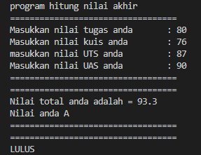
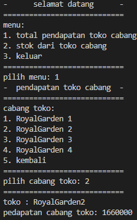
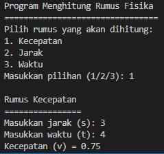
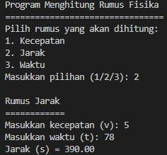
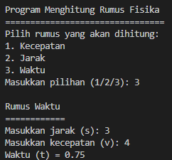

# Laporan praktikum pertemuan 1

NAMA : Kibar Mustofa 
KELAS : TI-1H 
NIM : 2341720004 
ABSEN : 14 

## Hasil Output Praktikum Pemilihan

Hasil Output dari Program hitung pemilihan:
1. hasil: LULUS apabila nilai di antara nilai huruf <83 dan <=50.

2. hasil: TIDAK LULUS apabila nilai >50.

## hasil output praktikum perulangan

hasil output dari program perulangan deret angka:
dalam program ini akan memberikan output input nim
n= niali terakhir dan output merupakan deretan angka. 

## hasil output praktikum array menghitung niali akhir dan IP

hasil output dari program array untuk memunculkan nilai angka,  nilai huruf, bobot nilai, dan ip. 

## hasil output praktikum fungsi menghitung pendapatan dan stock cabang toko

hasil output di bagi menjadi 2 :

1. hasil: pendapatan toko cabang

2. hasil: stock barang

## hasil output tugas untuk menyimpan array plat dan kota plat tersebut

berikut adalah contoh apabila progam menginputkan huruf sesuai dengan array plat dan kota yang telah di simpan 

## hasil output tugas 2 untuk membuat program untuk rumus fisika

berikut adalah beberapa hasil dari program yaitu:

1. mengitung kecepatan

2. menghitung jarak

3. menghitung waktu

