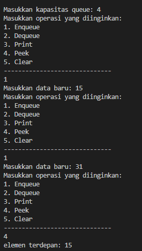
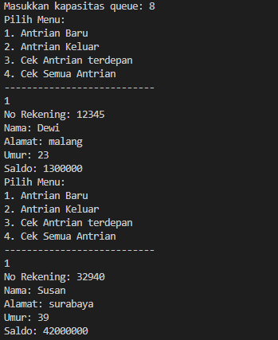
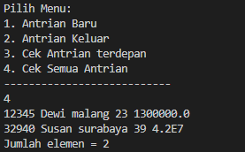
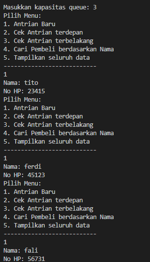
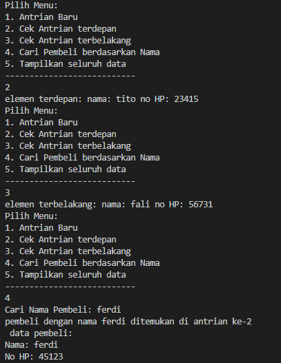
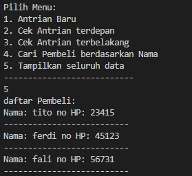

# laporan pertemuan 10 : Queue

NAMA : Kibar Mustofa<br>
KELAS : TI-1H<br>
NIM : 2341720004<br>
ABSEN : 14<br>
## prakrikum 1

### kode class:
```
package pertemuan10.praktikum1;

public class queue {
    int [] data;
    int front;
    int rear;
    int size;
    int max;

    public queue(int n) {           //KONSTRUKTOR
        max = n;
        data = new int [max];
        size = 0;
        front = rear =-1;
    }
    // Buat method IsEmpty bertipe boolean yang digunakan untuk mengecek apakah queue kosong

    public boolean isEmpty(){
        if(size == 0){
            return true;
        } else{
            return false;
        }
    }
    // Buat method IsFull bertipe boolean yang digunakan untuk mengecek apakah queue sudah penuh.

    public boolean isFull(){
        if(size == max){
            return true;
        }else{
            return false;
        }
    }
    //Buat method peek bertipe void untuk menampilkan elemen queue pada posisi paling depan.

    public void peek(){
        if (!isEmpty()){
            System.out.println("elemen terdepan: "+ data[front]);
        }else{
            System.out.println("Queue masih kosong");

        }
    }
    //Buat method print bertipe void untuk menampilkan seluruh elemen pada queue mulai dari posisi 
front sampai dengan posisi rear.
    public void print(){
        if(!isEmpty()){
            System.out.println("Queue masih kosong");
        }else{
            int i = front ;
            while (i != rear ){
                System.out.println(data[i]+"");
                i = (i+1) % max;
                
            }
            
        }
    }
    //Buat method clear bertipe void untuk menghapus semua elemen pada queue
    public void clear(){
        if (!isFull()){
            front = rear = -1;
            size = 0;
            System.out.println("Queue berhasil di kosongkan"); 
        }else{
            System.out.println("Queue masih kosong");
        }
    }
    //Buat method clear bertipe void untuk menghapus semua elemen pada queue

   public void enqueue(int dt){
        if (isFull()) {
            System.out.println("Queue sudah penuh");
        } else {
            if (isEmpty()) {
                front = rear = 0;
            } else {
                if (rear == max - 1) {
                    rear = 0;
                } else {
                    rear++;
                }
            }
            data[rear] = dt;
            size++;
        }
    }
    //Buat method Dequeue bertipe int untuk mengeluarkan data pada queue di posisi belakang
    public int dequeue(){
        int dt = 0;
        if (isEmpty()) {
            System.out.println("Queue masih kosong");
        } else {
            dt = data[front];
            size--;
            if (isEmpty()) {
                front = rear = -1;
            } else {
                if (front == max - 1) {
                    front = 0;
                } else {
                    front++;
                }
            }
        }
        return dt;
    }
}
```
## kode main
```
package pertemuan10.praktikum1;

import .util.Scanner;

public class queueMain {
    public static void menu(){
        // Buat 
method menu bertipe void untuk memilih menu program pada saat dijalankan.
        System.out.println("Masukkan operasi yang diinginkan:");
        System.out.println("1. Enqueue");
        System.out.println("2. Dequeue");
        System.out.println("3. Print");
        System.out.println("4. Peek");
        System.out.println("5. Clear");
        System.out.println("------------------------------");
    }

    public static void main(String[] args) {
        //Buat fungsi main, kemudian deklarasikan Scanner dengan nama sc.
        Scanner sc = new Scanner(System.in);
        //Buat variabel n untuk menampung masukan berupa jumlah maksimal elemen yang dapat 
disimpan pada queue.
        System.out.print("Masukkan kapasitas queue: ");
        int n = sc.nextInt();
        //Lakukan instansiasi objek Queue dengan nama Q dengan mengirimkan parameter n sebagai 
kapasitas elemen queue

        queue Q = new queue(n);
        int pilih;
        //Lakukan perulangan menggunakan do-while untuk menjalankan program secara terus menerus 
sesuai masukan yang diberikan. Di dalam perulangan tersebut, terdapat pemilihan kondisi 
menggunakan switch-case untuk menjalankan operasi queue sesuai dengan masukan pengguna.

        do {
            menu();
            pilih = sc.nextInt();
            switch (pilih) {
                case 1:
                    System.out.print("Masukkan data baru: ");
                    int dataMasuk = sc.nextInt();
                    Q.enqueue(dataMasuk);
                    break;
                case 2:
                    int dataKeluar = sc.nextInt();
                    if (dataKeluar != 0) {
                        System.out.println("Data yang diekeluarkan: " + dataKeluar);
                    }
                    break;
                case 3:
                    Q.print();
                    break;
                case 4:
                    Q.peek();
                    break;
                case 5:
                    Q.clear();
                    break;
            }
        } while (pilih == 1 || pilih == 2 || pilih == 3 || pilih == 3 || pilih == 4 || pilih == 5);
    sc.close();
    }
}
```
## hasil output:
 

## pertanyaan: 
1. Pada konstruktor, mengapa nilai awal atribut front dan rear bernilai -1, sementara atribut size bernilai 0?

- pada konstruktor, dimana nilai awal atribut front dan rear bernilai -1 serta size bernilai 0 karena pada awalnya antrian (queue) tersebut kosong. oleh karena itu front dan rear di berikan nilai -1 menunjukkan bahwa tidak ada elemen dalam antrian tersebut. size diinisialisasi menjadi 0 untuk menandakan bahwa jumlah elemen dalam queue adalah nol.

2. Pada method Enqueue, jelaskan maksud dan kegunaan dari potongan kode berikut!
```
if (rear == max- 1){
    rear = 0;
```
- jika rear mencapai nilai maksimum (akhir array), ia akan disetel kembali ke 0.

3. Pada method Dequeue, jelaskan maksud dan kegunaan dari potongan kode berikut!
```
if (rear == max- 1){
    rear = 0;
```
- ika front berada di akhir array, maka setelah elemen di posisi tersebut dikeluarkan, front disetel ke 0 untuk melanjutkan pengambilan (dequeuing) dari awal array.

4. Pada method print, mengapa pada proses perulangan variabel i tidak dimulai dari 0 (int i=0), melainkan int i=front?

-  pada method print, variabel i tidak dimulai dari 0 melainkan dari front karena antrian sirkular bisa dimulai dari posisi mana pun dalam array, tergantung di mana elemen pertama (front) berada setelah beberapa operasi enqueue dan dequeue.

5. Perhatikan kembali method print, jelaskan maksud dari potongan kode berikut!
```
i = (i + 1 )% max;
```
- digunakan untuk memajukan indeks i dan kembali ke awal array jika sudah mencapai akhir.
6. Tunjukkan potongan kode program yang merupakan queue overflow!
- 
```
 public void enqueue(int dt) {
        if (isFull()) {
            System.out.println("Queue sudah penuh");
        } else {
            if (isEmpty()) {
                front = rear = 0;
            } else {
                if (rear == max - 1) {
                    rear = 0; 
                } else {
                    rear++;
                }
            }
            data[rear] = dt;
            size++;
        }
    }
 ```
 
7. Pada saat terjadi queue overflow dan queue underflow, program tersebut tetap dapat berjalan 
dan hanya menampilkan teks informasi. Lakukan modifikasi program sehingga pada saat terjadi 
queue overflow dan queue underflow, program dihentikan!
```
public void enqueue(int dt){
    if (isFull()) {
        System.out.println("Queue sudah penuh");
        System.exit(0); //menghentikan program
    } else {
        if (isEmpty()) {
            front = rear = 0;
        } else {
            if (rear == max - 1) {
                rear = 0;
            } else {
                rear++;
            }
        }
        data[rear] = dt;
        size++;
    }
}

public nasabah dequeue(){
    int dt = 0;
    if (isEmpty()) {
        System.out.println("Queue masih kosong");
        System.exit(0); //menghentikan program
    } else {
        dt = data[front];
        size--;
        if (isEmpty()) {
            front = rear = -1;
        } else {
            if (front == max - 1) {
                front = 0;
            } else {
                front++;
            }
        }
    }
    return dt;
}
```

## percobaan 2:
### kode class nasabah:
```
package pertemuan10.praktikum2;

public class nasabah {
    String norek, nama, alamat;
    int umur;
    double saldo;

    nasabah(String norek, String nama, String alamat, int umur, double saldo){
        this.norek = norek;
        this.nama = nama;
        this.alamat = alamat;
        this.umur = umur;
        this.saldo = saldo;
    }
//Baris program Nasabah dt = new Nasabah(); akan ditandai sebagai error, untuk mengatasinya, 
tambahkan konstruktor default di dalam class Nasabah.

    nasabah(){
        
    }

}
```

### kode class queue:

```
package pertemuan10.praktikum2;

//akukan modifikasi pada class Queue dengan mengubah tipe int[] data menjadi Nasabah[] data
karena pada kasus ini data yang akan disimpan pada queue berupa object Nasabah.

public class queue {
    nasabah[] data;
    int front;
    int rear;
    int size;
    int max;

    public queue(int n){
        max = n;
        data = new nasabah[max];
        size = 0;
        front = rear = -1;        
    }

    public boolean isEmpty(){
        if (size == 0) {
            return true;
        } else {
            return false;            
        }
    }

    public boolean isFull(){
        if (size == max) {
            return true;
        } else {
            return false;
        }
    }

    public void peek(){
        if (!isEmpty()) {
            System.out.println("Elemen terdepan: " + data[front].norek + " " + data[front].nama + " " + data[front].alamat + " " + data[front].umur + " " + data[front].saldo);
        } else {
            System.out.println("Queue masih kosong");
        }
    }

    public void print(){
        if (isEmpty()) {
            System.out.println("Queue masih kosong");
        } else {
            int i = front;
            while (i != rear) {
                System.out.println(data[i].norek + " " + data[i].nama + " " + data[i].alamat + " " + data[i].umur + " " + data[i].saldo);
                i = (i + 1) % max;
            }
            System.out.println(data[i].norek + " " + data[i].nama + " " + data[i].alamat + " " + data[i].umur + " " + data[i].saldo);
            System.out.println("Jumlah elemen = " + size);
        }
    }

    public void clear(){
        if (!isEmpty()) {
            front = rear = -1;
            size = 0;
            System.out.println("Queue berhasil dikosongkan");
        } else {
            System.out.println("Queue masih kosong");
        }
    }

    public void enqueue(nasabah dt){
        if (isFull()) {
            System.out.println("Queue sudah penuh");
        } else {
            if (isEmpty()) {
                front = rear = 0;
            } else {
                if (rear == max - 1) {
                    rear = 0;
                } else {
                    rear++;
                }
            }
            data[rear] = dt;
            size++;
        }
    }

    public nasabah dequeue(){
        nasabah dt = new nasabah();
        if (isEmpty()) {
            System.out.println("Queue masih kosong");
        } else {
            dt = data[front];
            size--;
            if (isEmpty()) {
                front = rear = -1;
            } else {
                if (front == max - 1) {
                    front = 0;
                } else {
                    front++;
                }
            }
        }
        return dt;
    }
}

```
## hasil output:
 

 

## pertanyaan:
1. Pada class QueueMain, jelaskan fungsi IF pada potongan kode program berikut!
```
if (!"".equals(data.norek) && !"".equals(data.nama) && !"".equals(data.alamat) && data.umur != 0 && data.saldo != 0) {
                        System.out.println("Antrian yang keluar: " + data.norek + " " + data.nama + " " + data.alamat + " " + data.umur + " " + data.saldo);
                        break;
                    }
```

- baris kode tersebut digunakan suntuk memastikan apakah data telah diisi sebelum melakuakn operasi selanjutnya 

2. Lakukan modifikasi program dengan menambahkan method baru bernama peekRear pada class 
Queue yang digunakan untuk mengecek antrian yang berada di posisi belakang! Tambahkan pula 
daftar menu 5. Cek Antrian paling belakang pada class QueueMain sehingga method peekRear
dapat dipanggil!
```
public void peekRear(){
        if (!isEmpty()) {
            System.out.println("Elemen terbelakang: " + data[rear].norek + " " + data[rear].nama + " " + data[rear].alamat + " " + data[rear].umur + " " + data[rear].saldo);
        } else {
            System.out.println("Queue masih kosong");
        }
    }
```
## tugas:
Buatlah program antrian untuk mengilustasikan pesanan disebuah warung. Ketika seorang 
pembeli akan mengantri, maka dia harus mendaftarkan nama, dan nomor HP seperti yang 
digambarkan pada Class diagram berikut:
### class:
- Pembeli
### atribut:
- nama: String
- noHP: int
### method:
- Pembeli(nama: String, noHP: int)
Class diagram Queue digambarkan sebagai berikut:
### class:
- Queue
### atribut:
- antrian: Pembeli[]
- front: int
- rear: int
- size: int
- max: int
### method:
- Queue(n: int)
- isEmpty(): boolean
- isFull(): boolean
- enqueue(antri: Pembeli): void
- dequeue(): int
- print(): void
- peek(): void
- peekRear(): void
- peekPosition(nama: String): void
- daftarPembeli(): void
Keterangan:
• Method create(), isEmpty(), isFull(), enqueue(), dequeue() dan print(), kegunaannya sama seperti 
yang telah dibuat pada Praktikum
• Method peek(): digunakan untuk menampilkan data Pembeli yang berada di posisi antrian paling 
depan
• Method peekRear(): digunakan untuk menampilkan data Pembeli yang berada di posisi antrian 
paling belakang
• Method peekPosition(): digunakan untuk menampilkan seorang pembeli (berdasarkan nama)
posisi antrian ke berapa
• Method daftarPembeli(): digunakan untuk menampilkan data seluruh pembeli

### class pembeli:
```
package pertemuan10.tugas;

public class pembeli {
    String nama;
    int noHp;

    pembeli(String nama, int noHp){
        this.nama = nama;
        this.noHp = noHp;

    }
    pembeli(){
    
    }
}
```
### class queue:
```
package pertemuan10.tugas;

public class queue {
    pembeli[] antrian;
    int front, rear, size, max;

    public queue(int n){
        max = n;
        antrian = new pembeli[max];
        size = 0;
        front = rear = -1;  
    }

    public boolean isEmpty(){
        if (size == 0) {
            return true;
        } else {
            return false;            
        }
    }

    public boolean isFull(){
        if (size == max) {
            return true;
        } else {
            return false;
        }
    }

    public void enqueue(pembeli antri){
        if (isFull()) {
            System.out.println("Queue sudah penuh");
        } else {
            if (isEmpty()) {
                front = rear = 0;
            } else {
                if (rear == max - 1) {
                    rear = 0;
                } else {
                    rear++;
                }
            }
            antrian[rear] = antri;
            size++;
        }
    }

    public pembeli dequeue(){
        pembeli antri = new pembeli();
        if (isEmpty()) {
            System.out.println("Queue masih kosong");
        } else {
            antri = antrian[front];
            size--;
            if (isEmpty()) {
                front = rear = -1;
            } else {
                if (front == max - 1) {
                    front = 0;
                } else {
                    front++;
                }
            }
        }
        return antri;
    }

    public void print(){
        if (isEmpty()) {
            System.out.println("Queue masih kosong");
        } else {
            int i = front;
            while (i != rear) {
                System.out.println(antrian[i].nama + " ");
                i = (i + 1) % max;
            }
            System.out.println(antrian[i].nama + " ");
            System.out.println("jumlah elemen = " + size);
        }
    }

    public void peek(){
        if (!isEmpty()) {
            System.out.println("elemen terdepan: " +  "nama: "+antrian[front].nama + " no HP: " + antrian[front].noHp);
        } else {
            System.out.println("Queue masih kosong");
        }
    }

    public void peekRear(){
        if (!isEmpty()) {
            System.out.println("elemen terbelakang: " + "nama: " + antrian[rear].nama + " no HP: " + antrian[rear].noHp);
        } else {
            System.out.println("Queue masih kosong");
        }
    }

    public int peekPosition(String nama){
        if (isEmpty()) {
            return -1; 
        }
        int pos = -1; 
        int index = front;
        int count = 0;
        while (index != rear){
            if (antrian[index].nama.equals(nama)) {
                pos = count; 
                break;
            }
            index = (index + 1) % max; 
            count++;
        } if (antrian[index].nama.equals(nama)) {
            pos = count;
        }
        if (pos != -1) {
            System.out.println("pembeli dengan nama " + nama + " ditemukan di antrian ke-" + (pos + 1));
            System.out.println(" data pembeli:");
            System.out.println("Nama: " + antrian[(front + pos) % max].nama);
            System.out.println("No HP: " + antrian[(front + pos) % max].noHp);
        } else {
            System.out.println("pembeli dengan nama " + nama + " tidak ditemukan dalam antrian");
        }
        return pos; 
    }
    public void daftarPembeli(){
        if (isEmpty()) {
            System.out.println("queue masih kosong");
        } else {
            System.out.println("daftar Pembeli:");
            int i = front;
            do {
                System.out.println("Nama: " + antrian[i].nama + " no HP: " + antrian[i].noHp);
                i = (i + 1) % max;
                System.out.println("--------------------------");
            } while (i != (rear + 1) % max);
        }
    }   
}

```
### class queueMain:
```
package pertemuan10.tugas;

import java.util.Scanner;

public class queueMain {
    public static void menu(){
        System.out.println("Pilih Menu: ");
        System.out.println("1. Antrian Baru");
        System.out.println("2. Cek Antrian terdepan");
        System.out.println("3. Cek Antrian terbelakang");
        System.out.println("4. Cari Pembeli berdasarkan Nama");
        System.out.println("5. Tampilkan seluruh data");
        System.out.println("---------------------------");
    }

    public static void main(String[] args) {
        Scanner sc = new Scanner(System.in);

        System.out.print("Masukkan kapasitas queue: ");
        int jumlah = sc.nextInt();
        queue antri = new queue(jumlah);

        int pilih;

        do {
            menu();
            pilih = sc.nextInt();
            sc.nextLine();
            switch (pilih) {
                case 1:
                    System.out.print("Nama: ");
                    String nama = sc.nextLine();
                    System.out.print("No HP: ");
                    int noHp = sc.nextInt();
                    pembeli pb = new pembeli(nama, noHp);
                    sc.nextLine();
                    antri.enqueue(pb);
                    break;
                case 2:
                    antri.peek();
                    break;
                case 3:
                    antri.peekRear();
                    break;
                case 4:
                    System.out.print("Cari Nama Pembeli: ");
                    String cari = sc.nextLine();
                    antri.peekPosition(cari);
                    break;
                case 5:
                    antri.daftarPembeli();
                    break;
            }
        } while (pilih != 0);
        sc.close();
    }
}
```
### hasil output:
 
 
 