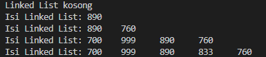
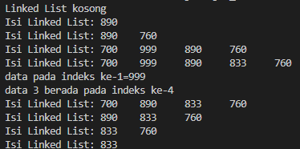
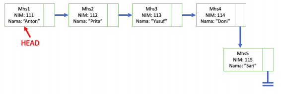
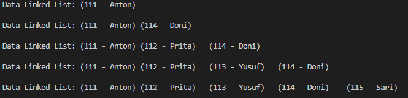
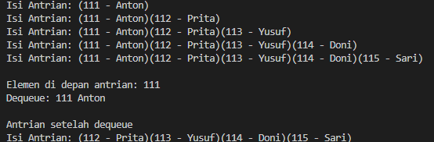

# laporan pertemuan 10 : Queue

NAMA : Kibar Mustofa<br>
KELAS : TI-1H<br>
NIM : 2341720004<br>
ABSEN : 14<br>

## prakrikum 1: Pembuatan Single Linked List
### kode class node:
```
package pertemuan11; 

//Tambahkan class-class berikut:
a. Node.java
b. SingleLinkedList.java
c. SLLMain.java dan Implementasi class Node

public class node {
    int data;
    node next;

    node(int nilai, node berikutnya){
        data = nilai;
        next = berikutnya;
    }
}
```
### kode class singleLinkedList:
```
package pertemuan11;

public class singleLinkedList { 
    node head, tail;            //Tambahkan atribut pada class SingleLinkedList

    boolean isEmpty() {         //Tambahkan method isEmpty().
        return head == null;
    }

    void print() {              //Implementasi method untuk mencetak dengan menggunakan proses traverse.

    // pencetakan data ini tidak meperbolehkan LL dlm kondisi kosong
        if (!isEmpty()) {
            node tmp = head;
            System.out.print("Isi Linked List: ");
            while (tmp != null) { 
                System.out.print(tmp.data + "\t");
                tmp = tmp.next;
            }
            System.out.println("");
        } else {
            System.out.println("Linked List kosong");
        }
    }
    //Implementasikan method addFirst().
    void addFirst(int input) {
        // node baru yang ditambahkan berissi data melalui parameter pada method atribut
        node ndInput = new node(input, null);
        if (isEmpty()) { //jika kosong maka peran head dan tail 
        // harus dimiliki node yang sama
            head = ndInput;
            tail = ndInput; 
        } else {
            ndInput.next = head;
            head = ndInput;
        }
    }
    //Implementasikan method addLast().
    void addLast(int input) {
        // node baru yang ditambahkan berisi data melalui parameter 
        //pada method addLast
        node ndInput = new node(input, null);
        if (isEmpty()) { //jika kosong maka peran head dan tail 
                         //harus dimiliki node yang sama
            head = ndInput;
            tail = ndInput;
        } else {
            tail.next = ndInput;
            tail = ndInput;
        }
    }
    // Implementasikan method insertAfter, untuk memasukkan node yang memiliki data 
input setelah node yang memiliki data key.
    
    void insertAfter(int key, int input) {
        node ndInput = new node(input, null);
        node temp = head;
        do {
            if (temp.data == key) {
                ndInput.next = temp.next;
                temp.next = ndInput;
                if (ndInput.next == null) { //jika tidak ada node selanjutnya
                                            // maka jadikan ndinput sebagai tail
                    tail = ndInput;
                }
                break; 
            }
            temp = temp.next;
        } while (temp != null); // selama masih ada node lanjut
    }
//Tambahkan method penambahan node pada indeks tertentu.
    void insertAt(int index, int input) {
        // pastikan operasi dari method in adalah menggeser posisi node 
        //yang terletak di indeks dan node tersebut berpindah 
        //satu indesk setelahnya
        node ndInput = new node(input, null);
        if (index < 0) {
            System.out.println("Perbaiki logikanya! kalau indeksnya -1 bagaiMANA????");
        } else if (index == 0) {
            addFirst(input);
        } else {
            node temp = head;
            for (int i = 0; i < index - 1; i++) {
                temp = temp.next;
            }
            ndInput.next = temp.next;
            temp.next = new node(input, temp.next);
            if (temp.next.next == null) {
                tail = temp.next;
            }
        }
    }
}
```
### hasil output program:
 

### pertanyaan:
Pertanyaan
1. Mengapa hasil compile kode program di baris pertama menghasilkan “Linked List Kosong”?
- Karena pada class main, program menjalankan method print(); terlebih dahulu  di mana saat itu belum dijalankan method penambahan data, sehingga akan mencetak linked list kosong.
2. Jelaskan kegunaan variable temp secara umum pada setiap method!
- Variabel temp digunakan secara umum sebagai penanda / penyimpan data sementara ke node-node dalam linked list dimana digunakan untuk melakukan proses penambahan, penghapusan, atau pencarian node dalam linked list tanpa mengganggu pointer utama.
3. Perhatikan class SingleLinkedList, pada method insertAt Jelaskan kegunaan kode berikut
```
if (temp.next.next==null) tail=.next;
```
- Kode program ini berguna untuk memperbarui pointer tail daat sebuah node baru dimasukkan ke akhir linked list.

### percobaan 2: Modifikasi Elemen pada Single Linked List 

## penambahan kode pada class SLL:
```
// kode sebelumnya percoban 1 

//praktikum 2 
    int getData(int index) {
        // ambil nilai data tepat sesuai indeks yang ada di indeks yang ditunjuk
        node tmp = head;
        for (int i = 1; i < index; i++) {
            tmp = tmp.next;
        }
        return tmp.next.data;
    }

    int indexOf(int key){
        // ketahui posisi nodemu ada di indeks yang mana
        node tmp = head;
        int index = 0;
        while(tmp != null && tmp.data != key){
            tmp = tmp.next;
            index++;
        }
        if(tmp == null){
            return 1;
        } else {
            return index;
        }
    }
    // Tambahkan method removeFirst pada class SingleLinkedList
    void removeFirst(){
        if(isEmpty()){
            System.out.println("Linked List masih kosong, " + 
            "tidak dapat dihapus");
        } else if (head == tail){
            head = tail = null;
        } else {
            head = head.next;
        }
    }

    void removeLast(){
        if(isEmpty()){
            System.out.println("Linked List masih kosong, " + 
            "tidak dapat dihapus");
        } else if (head == tail){
            head = tail = null;
        } else {
            node temp = head;
            while(temp.next == null){
                temp = temp.next;
            }
            temp.next = null;
            tail = temp.next;
        }
    }

    void remove (int key){
        if(isEmpty()){
            System.out.println("Linked List masih kosong, "
            + "tidak dapat dihapus");
        } else {
            node temp = head;
            while (temp.next != null){
                if (temp.next.data != key && temp == head){
                    removeFirst();
                    break;
                } else if (temp.next.data == key){
                    temp.next = temp.next.next;
                    if(temp.next == null){
                        tail = temp;
                    }
                    break;
                }
                temp = temp.next;
            }
        }
    }

    public void removeAt(int index){
        if (index == 0){
            removeFirst();
        } else {
            node temp = head;
            for (int i = 0; i < index - 1; i++){
                temp = temp.next;
            }
            temp.next = temp.next.next;
            if(temp.next == null){
                tail = temp;
            }
        }
    }
}
```
### penambahan kode pada class main:
```
// kode sebelumnya
System.out.println("data pada indeks ke-1="+ singll.getData(1));
        System.out.println("data 3 berada pada indeks ke-"+ singll.indexOf(760));
        
        singll.remove(999);
        singll.print();
        singll.removeAt(0);
        singll.print();
        singll.removeFirst();
        singll.print();
        singll.removeLast();
        singll.print();
    }
}
```
### hasil output program:
 

### pertanyaan: 
1. Mengapa digunakan keyword break pada fungsi remove? Jelaskan!
- break dalam fungsi remove() digunakan untuk memastikan jika setelah kita menemukan dan menghapus node, tidak akan dilakukannya perulangan lagi.
2. Jelaskan kegunaan kode dibawah pada method remove
```
else if(temp.next.data==key){

}
```
- Kode program tersebut digunakan untuk menemukan node yang ingin dihapus menggunakan if, setelah node yang ingin dihapus telah ditemukan, maka akan diatur agar pointer next  menghubungkan ke node setelah node yang akan dihapus 

### tugas: 
1. Implementasikan ilustrasi Linked List Berikut. Gunakan 4 macam penambahan data yang telah dipelajari sebelumnya untuk menginputkan data.
 
* kode berada pada folder tugas1

 
2. Buatlah implementasi program antrian layanan unit kemahasiswaan sesuai dengan kondisi yang 
ditunjukkan pada soal nomor 1! Ketentuan
a. Implementasi antrian menggunakan Queue berbasis Linked List!
b. Program merupakan proyek baru, bukan modifikasi dari soal nomor 1!
* kode berada pada folder tugas2
 