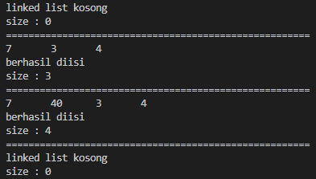

# laporan pertemuan 12 : double linkedlist

NAMA : Kibar Mustofa<br>
KELAS : TI-1H<br>
NIM : 2341720004<br>
ABSEN : 14<br>

## percobaan 1 :  menambahkan data dengan beberapa cara (dari bagian depan linked list, belakang ataupun indeks tertentu pada linked list)
### kode class node :
```
package pertemuan12;

public class node {
    int data;
    node prev, next;

    node(node prev, int data, node next ){
        this.prev=prev;
        this.data=data;
        this.next=next;
    }
}
```

### kode class double linked list
```
package pertemuan12;

public class doubleLinkedList {
   node head;
   int size;
   public doubleLinkedList(){
        head = null;
        size = 0;
   } 
    public boolean isEmpty(){
        return head == null;
    }
    public void addFirst(int item){
        if (isEmpty()){
            head = new node (null, item, null);
        }else{
            node newNode = new node(null, item, head);
            head.prev = newNode;
            head = newNode;
        }
        size++;
    }
    public void addLast(int item){
        if (isEmpty()){
            addFirst(item);
        }else{
            node current = head;
            while (current.next != null){
                current = current.next;
            }
            node newNode = new node(current, item, null);
            current.next = newNode;
            size++;
        }
    }
    public void add(int item, int index) throws Exception {
        if (isEmpty()){
            addFirst(item);
        }else if (index < 0 || index > size) {
            throw new Exception("nilai indeks di luar batas");
        }else{
            node current = head;
            int i = 0;
            while (i < index){
                current = current.next;
                i++;
            }
            if (current.prev == null){
                node newNode = new node (null,item, current);
                current.prev = newNode;
                head = newNode;
            }else {
                node newNode = new node (current.prev, item, current);
                newNode.prev = current.prev;
                newNode.next = current;
                current.prev.next = newNode;
                current.prev = newNode;
            }
        }
        size++;
    }
    public int size(){
        return size;
    } 
    public void clear(){
        head = null;
        size = 0;
    }
    public void print() { 
        if (!isEmpty()){
            node tmp = head;
            while (tmp != null){
                System.out.print(tmp.data + "\t");
                tmp = tmp.next;
            }
            System.out.println("\nberhasil diisi");
        }else {
            System.out.println("linked list kosong");
        }
    }
```
### kode main :
```
package pertemuan12;

public class doubleLinkedListMain {
   public static void main(String[] args) throws Exception { 
    // throws exception digunakan apabila program tidak bida mengatasi problem yang terjadi
    // praktikum 1 main   
    System.out.println("percobaan 1 add");
    doubleLinkedList dll = new doubleLinkedList();
        dll.print();
        System.out.println("size : "+dll.size());
        System.out.println("======================================================");
        dll.addFirst(3);
        dll.addLast(4);
        dll.addFirst(7);
        dll.print();
        System.out.println("size : "+dll.size());
        System.out.println("======================================================");
        dll.add(40,1);
        dll.print();
        System.out.println("size : "+dll.size());
        System.out.println("======================================================");
        dll.clear();
        dll.print();
        System.out.println("size : "+dll.size());
```      
### hasil output percobaan 
 

### pertanyaan:
1. Jelaskan perbedaan antara single linked list dengan double linked lists!
- perbedaan yang mencolok yaitu pada pointernya untuk single LL pointer Hanya memiliki satu pointer yang menunjuk ke node berikutnya dan setiap node menyimpan data dan refrensi node selanjutnya.
- sedangkan double LL memiliki 2 pointer yang dapat digunakan untuk menyimpan data node sebelum dan sesudahnya
2. Perhatikan class Node, di dalamnya terdapat atribut next dan prev. Untuk apakah atribut 
tersebut?
- yaitu untuk menunjukan refrensi bagian yang merupakan bagian dari node sebelum/prev dan sesudah/next
3. Perhatikan konstruktor pada class DoubleLinkedLists. Apa kegunaan inisialisasi atribut head dan 
size seperti pada gambar berikut ini?
```java
public DoubleLinkedLIsts(){
    head = null;
    size = 0;
}
```
- digunakan untuk menginisialisasikan linked listskosong dan untuk mempermudah menambahkan node  pertama.
4. Pada method addFirst(), kenapa dalam pembuatan object dari konstruktor class Node prev 
dianggap sama dengan null?

Node newNode = new Node(null, item,head);
- Dalam pembuatan objek baru dari konstruktor class Node, parameter prev dianggap sama dengan null dalam pemanggilan new Node(null, item, head) 

5. Perhatikan pada method addFirst(). Apakah arti statement head.prev = newNode ?
- Dalam kode head.prev = newNode, disini membuat atribut prev dari node head dengan mengambil referensi ke node baru yang baru saja dibuat.
6. Perhatikan isi method addLast(), apa arti dari pembuatan object Node dengan mengisikan 
parameter prev dengan current, dan next dengan null?
Node newNode = new Node(current, item, null);
- pada method add last baris kode tersebut digunakan untuk menunjukan bahwa node baru ini akan menjadi node terakhir dengan mengatur atribut next berupa null.
7. Pada method add(), terdapat potongan kode program sebagai berikut:
jelaskan maksud dari bagian yang ditandai dengan kotak kuning.
 

## percobaan 2:Penghapusan dilakukan dalam tiga cara di bagian paling depan, paling belakang, dan sesuai indeks yang ditentukan pada linkedLists

### kode class: 
sama seperti pecobaan 1

### kode class DLL:
```
// tambahan pada materi 2 
    public void removeFirst() throws Exception{ 
        if(isEmpty()){
            throw new Exception("linked list masih kosong, tidak dapat dihapus ");
        }else if (size == 1){
            removeLast();
        }else{
            head = head.next;
            head.prev = null;
            size--;
        }
    }
    public void removeLast() throws Exception{
        if (isEmpty()){
            throw new Exception("linked list masih kosong, tidak dapat dihapus ");
        } else if(head.next == null){
            head = null;
            size--;
            return;
        }
        node current = head;
        while (current.next.next != null){
            current = current.next;
        }
        current.next=null;
        size--;
    }
    public void remove(int index) throws Exception{
        if(isEmpty()|| index>= size){
            throw new Exception("linked list masih kosong, tidak dapat dihapus ");
        }else if (index ==  0 ){
            removeFirst();
        }else{
            node current = head;
            int i = 0;
            while (i < index) {
                current = current.next;
                i++;
            }
            if (current.next == null){
                current.prev.next=null;
            }
            else if (current.prev ==  null){
                current = current.next;
                current.prev = null;
                head = current;
            }
            size--;
        }
    }
```
### kode main DLL:
```
// tambahan kode praktikum 2 
 System.out.println("percobaan 2 remove");
        dll.addLast(50);
        dll.addLast(40);
        dll.addLast(10);
        dll.addLast(20);
        dll.print();
        System.out.println("size : "+dll.size());
        System.out.println("======================================================");
        dll.removeFirst();
        dll.print();
        System.out.println("size : "+dll.size());
        System.out.println("======================================================");
        dll.removeLast();
        dll.print();
        System.out.println("size : "+dll.size());
        System.out.println("======================================================");
        dll.remove(1);
        dll.print();
        System.out.println("size : "+dll.size());
```
### hasil output program percobaan 2:
  

### pertanyaan:
1. Apakah maksud statement berikut pada method removeFirst()?
head = head.next;
head.prev = null;
- pada baris kode tersebut digunakan untuk memindahkan atau menggeser posisi head ke node yang ke 2 kemudia mengubah pointer prev currentnya adalah head menjadi null.
2. Bagaimana cara mendeteksi posisi data ada pada bagian akhir pada method removeLast()?
-  dengan cara perulangan yang digunakan pada node linkelist untuk mencari node kedua terakhir
3. Jelaskan alasan potongan kode program di bawah ini tidak cocok untuk perintah remove
```java
node  tmp = head.next;

head.next=tmp.next;
tmp.next.prev=head;
```
- tmp seharusnya node pertama merupakan head bukan head.next. Dan dengan mengatur head.next ke tmp.next, maka akan melewati node kedua dan langsung menghubungkan node pertama ke node setelahnya.
4. Jelaskan fungsi kode program berikut ini pada fungsi remove!
```java
current.prev.next = current.next;
current.next.prev = current prev;
```
- pada bagian tersebut digunakan untuk menghubungkan node sebelumnya  dan sesudahnya node yang akan di hapus sehingga memutukan hubungan atara node current dan node yang akan dihapus 
## praktikum 3:  yaitu mengambil data paling awal, paling akhir dan data pada indeks tertentu dalam linked list.

### kode class node:
sama dengan percobaan pertama

### kode class DLL :
```
// berikut merupakan perubahan dari percobaan 3  
 public int getFirst() throws Exception{
        if (isEmpty()){
            throw new Exception("linked list masih kosong, tidak dapat dihapus ");
        }
        return head.data;
    }
    public int getLast() throws Exception {
        if (isEmpty()){
            throw new Exception("linked list masih kosong, tidak dapat dihapus ");
        }
        node tmp = head;
        while (tmp.next !=null){
            tmp = tmp.next;
        }
        return tmp.data;
    }
    public int get(int index) throws Exception {
        if (isEmpty() || index >= size){
            throw new Exception("linked list masih kosong, tidak dapat dihapus ");
        } 
        node tmp = head;
        for(int i = 0; i < index; i++){
            tmp = tmp.next;
        } 
        return tmp.data;
    }
}
```

### kode main DLL:
```
//
System.out.println("size : " +dll.size());
        System.out.println("====================="  );
        dll.addFirst(3);
        dll.addLast(4);
        dll.addFirst(7);
        dll.print();
        System.out.println("size : " +dll.size());
        System.out.println("====================="  );
        dll.add(40, 1);
        dll.print();
        System.out.println("size : " +dll.size());
        System.out.println("====================="  );
        System.out.println("data awal pada linked lists adalah: " +dll.getFirst());
        System.out.println("data akhir linked lists adalah: " +dll.getLast());
        System.out.println("pada indeks ke - 1 pada linked lists adalah: " + dll.get(1));
    } 
}
```
### hasil output program:


### pertanyaan:
1. Jelaskan method size() pada class DoubleLinkedLists!
- digunakan untuk mengembalikan jumlah eleen  atau beberapa node pada double linked lists
2. Jelaskan cara mengatur indeks pada double linked lists supaya dapat dimulai dari indeks ke-
1!
- dengann cara mengubah beberapa metode Metode add(int item, int index): Mengubah logika dalam metode add sehingga ketika kita menambahkan elemen pada indeks ke-1, itu akan menambahkannya sebagai elemen pertama dalam linked list, bukan sebelumnya. 
3. Jelaskan perbedaan karakteristik fungsi Add pada Double Linked Lists dan Single Linked Lists!
- setiap node pada DobLL memiliki 2 pointer yang dapat menyimpan refrensi data baik sebelum maupun sesudah dan perlu memperbarui dan menghubungkan apabila ada perubahan sebagai contoth ada node baru, sedangkan singLL hanya menggunakan 1 pointer yang akan me refrernsi kan ke node berikutnya 
4. Jelaskan perbedaan logika dari kedua kode program di bawah ini!

-Potongan kode pertama menggunakan variabel size untuk menentukan apakah linked list kosong atau tidak. Linked list dianggap kosong jika tidak ada elemen yang disimpan di dalamnya yaitu saat size = 0 Potongan kode kedua menggunakan variabel head untuk menentukan apakah linked list kosong atau tidak.dan akan menunjukan bahwa liked list ini tidak memiliki head
 
## tugas

1. Buat program antrian vaksinasi menggunakan queue berbasis double linked list sesuai ilustrasi dan menu di bawah ini! (counter jumlah antrian tersisa di menu cetak(3) dan data orang yang telah divaksinasi di menu Hapus Data(2) harus ada) 
- kode sudah ada pada folder tugas1


2. Buatlah program daftar film yang terdiri dari id, judul dan rating menggunakan double linked lists, bentuk program memiliki fitur pencarian melalui ID Film dan pengurutan Rating secara descending. Class Film wajib diimplementasikan dalam soal ini.
- kode sudah ada pada folder tugas2


