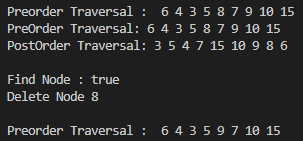
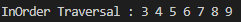
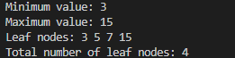

# laporan pertemuan 10 : Queue

NAMA : Kibar Mustofa<br>
KELAS : TI-1H<br>
NIM : 2341720004<br>
ABSEN : 14<br>

## Kegiatan Praktikum 1: Implementasi Binary Search Tree menggunakan Linked List

### kode class node:
```
package pertemuan13;

public class node14 {
    int data;
    node14 left;
    node14 right;

    public node14(){
    }
    public node14(int data){
        this.left= null;
        this.data= data;
        this.right= null;
    }
}
```
### kode class binarytree:
```
package pertemuan13;

public class BinaryTree14 {
    node14 root;

    BinaryTree14(){
        root = null;
    }
    boolean isEmpty(){
        return root == null;
    }
    void add(int data){
        if (isEmpty()) {
            root = new node14(data);
        } else {
            node14 current = root;
            while (true) {
                if (data > current.data) {
                    if (current.right == null) {
                        current.right = new node14(data);
                        break;
                    } else {
                        current = current.right;
                    }
                } else if (data < current.data) {
                    if (current.left == null) {
                        current.left = new node14(data);
                        break;
                    } else {
                        current = current.left;
                    }
                } else {
                    break;
                }
            }
        }
    }
    boolean find(int data){
        node14 current = root;
        while (current != null) {
            if (current.data == data) {
                return true;
            } else if (data > current.data) {
                current = current.right;
            } else {
                current = current.left;
            }
        }
        return false;
    }
    
    void traversePreOrder(node14 node){
        if (node != null) {
            System.out.print(" " + node.data);
            traversePreOrder(node.left);
            traversePreOrder(node.right);
        }
    }
    
    void traversePostOrder(node14 node){
        if (node != null) {
            traversePostOrder(node.left);
            traversePostOrder(node.right);
            System.out.print(" " + node.data);
        }
    }
    
    void traverseInOrder(node14 node){
        if (node != null) {
            traverseInOrder(node.left);
            System.out.print(" " + node.data);
            traverseInOrder(node.right);
        }
    }
    
    node14 getSuccessor(node14 del){
        node14 successor = del.right;
        node14 successorParent = del;
        while (successor.left != null) {
            successorParent = successor;
            successor = successor.left;
        }
        if (successor != del.right) {
            successorParent.left = successor.right;
            successor.right = del.right;
        }
        return successor;
    }
    
    void delete(int data){
        if (isEmpty()) {
            System.out.println("Tree is Empty");
            return;
        }
        
        node14 parent = root;
        node14 current = root;
        boolean isLeftChild = false;
        
        while (current != null) {
            if (current.data == data) {
                break;
            } else if (data < current.data) {
                parent = current;
                current = current.left;
                isLeftChild = true;
            } else {
                parent = current;
                current = current.right;
                isLeftChild = false;
            }
        }
        
        if (current == null) {
            System.out.println("Couldn't find data");
            return;
        }
        
        if (current.left == null && current.right == null) {
            if (current == root) {
                root = null;
            } else {
                if (isLeftChild) {
                    parent.left = null;
                } else {
                    parent.right = null;
                }
            }
        } else if (current.left == null) {
            if (current == root) {
                root = current.right;
            } else {
                if (isLeftChild) {
                    parent.left = current.right;
                } else {
                    parent.right = current.right;
                }
            }
        } else if (current.right == null) {
            if (current == root) {
                root = current.left;
            } else {
                if (isLeftChild) {
                    parent.left = current.left;
                } else {
                    parent.right = current.left;
                }
            }
        } else {
            node14 successor = getSuccessor(current);
            if (current == root) {
                root = successor;
            } else {
                if (isLeftChild) {
                    parent.left = successor;
                } else {
                    parent.right = successor;
                }
            }
            successor.left = current.left;
        }
        
    }
}
```
### kode main:
```
package pertemuan13;

public class BinaryTreeMain14 {
    public static void main(String[] args) {
        BinaryTree14 bt = new BinaryTree14();

        //rekursif
        bt.addRekurisif(6);
        bt.addRekurisif(4);
        bt.addRekurisif(8);
        bt.addRekurisif(3);
        bt.addRekurisif(5);
        bt.addRekurisif(7);
        bt.addRekurisif(9);
        bt.addRekurisif(10);
        bt.addRekurisif(15);

        System.out.println("");
        System.out.print("Preorder Traversal : ");
        bt.traversePreOrder(bt.root);

        System.out.println("");
        System.out.print("PreOrder Traversal:");
        bt.traversePreOrder(bt.root);
        System.out.println();

        System.out.print("PostOrder Traversal:");
        bt.traversePostOrder(bt.root);
        System.out.println();

        System.out.println("");
        System.out.println("Find Node : "+bt.find(5));

        System.out.println("Delete Node 8");
        bt.delete(8);

        System.out.println("");
        System.out.print("Preorder Traversal : ");
        bt.traversePreOrder(bt.root);
    }
}
```
## output hasil
 
### pertanyaan:
1. Mengapa dalam binary search tree proses pencarian data bisa lebih efektif dilakukan dibanding 
binary tree biasa?
- binary search tree memiliki aturan yang jelas mengenai dimana data tersebut ditempatkan dan dapat memiliki nilai yang lebih efisien dari pada binary tre yang harus mencari satu persatu
2. Untuk apakah di class Node, kegunaan dari atribut left dan right?
- dikarenakan atribut left dan right sebagai pointer atau penunjuk dimana letak data child/ anak. Atribut left menunjukkan ke child disebelah kiri, dan right menunjukkan ke child disebelah kanan.
3.  a. Untuk apakah kegunaan dari atribut root di dalam class BinaryTree?
    - digunakan untuk node utama dari sebuah tree
    b. Ketika objek tree pertama kali dibuat, apakah nilai dari root?
    - atribut root akan memiliki nilai null terlebih dahulu
4. Ketika tree masih kosong, dan akan ditambahkan sebuah node baru, proses apa yang akan terjadi?
- akan terjadi proses pengecekan terlbih dahulu, yaitu mengecek apakah tree kosong, jika iya, maka node baru akan ditambahkan dan akan  dijadikan sebagai root.
5. Perhatikan method add(), di dalamnya terdapat baris program seperti di bawah ini. Jelaskan 
secara detil untuk apa baris program tersebut?
if(data<current.data){
 if(current.left!=null){
 current = current.left;
 }else{
 current.left = new Node(data);
 break;
 }
}
- Pertama, akan dilakukan pengecekan apakah data yang ditmabahkan lebih kecil dari data di node saat ini. JIka iya, maka akan dilanjutkan proses pengecekan berikutnya, yakni apakah node anak kiri dari node saat ini tidak null/ kosong. Jika tidak null, maka pointer current/ pointer node-saat-ini akan dipindahkan ke node-anak-kiri dari node-saat-ini. Namun jika current.left (anak-kiri dari node-saat-ini) adalah kosong, maka data yang akan ditambahkan akan diletakkan di node current.left ini.

## Kegiatan Praktikum 2: Implementasi binary tree dengan array

### kode class:
```
package pertemuan13;

public class BinaryTreeArray14 {
    int[] data;
    int idxLast;

    public BinaryTreeArray14(){
        data = new int [10];
    }
    void populateData(int data[], int idxLast){
        this.data = data;
        this.idxLast = idxLast;
    }

    public void traverseInOrder(int index) {
        if (index <= idxLast) {
            traverseInOrder(2 * index + 1);
            System.out.print(data[index] + " ");
            traverseInOrder(2 * index + 2);
        }
    }
   

}

```

### kode main:
```
public class BinaryTreeArrayMain14 {
    public static void main(String[] args) {
        BinaryTreeArray14 bta = new BinaryTreeArray14();
        int[] data = {6,4,8,3,5,7,9,0,0,0};
        int idxLast = 6;
        bta.populateData(data,idxLast);
        System.out.print("\nInOrder Traversal : ");
        bta.traverseInOrder(0);
    }
}
```
### hasil output:
 

### Pertanyaan Percobaan
1. Apakah kegunaan dari atribut data dan idxLast yang ada di class BinaryTreeArray?
- Atribut data adalah variabel yang digunakan untuk menyimpan data atua nilai, dan idxLast adalah indeks terkahir dari node yang ada pada data.

2. Apakah kegunaan dari method populateData()?
- Method populateData() digunakan untuk mengisi nilai pada data dan mengatur nilai indeks terakhir dari data yang disimpan.

3. Apakah kegunaan dari method traverseInOrder()?
- method traverseInOrder() digunakan untuk melakukan penelusuran pada binary tree yang nantinya akan diprint dalam bentuk urutan nilai dengan urutan left-root-right

4. Jika suatu node binary tree disimpan dalam array indeks 2, maka di indeks berapakah posisi left child dan rigth child masin-masing?
- Dengan root yang dimulai dari index 0,
maka anak kiri dari node 2 berada di indeks ke = 2i+1 = 2(2)+1 = 5
dan anak kanan dari node 2 berada di indeks ke = 2i+2 = 2(2)+2 = 6

5. Apa kegunaan statement int idxLast = 6 pada praktikum 2 percobaan nomor 4?
- statement int idxLast = 6 digunakan untuk menginisialisai variabel idxLast dengan nilai 6, yang menunjukkan bahwa akan ada 7 nilai yang diprint atau kurang dari sama dengan indeks ke-6.

### Tugas Praktikum

1. Buat method di dalam class BinaryTree yang akan menambahkan node dengan cara 
rekursif.
```java
 void addRekurisif(int data) {
        root = addRekursif(root, data);
    }

    // Method rekursif untuk menambahkan node
    node14 addRekursif(node14 current, int data) {
        if (current == null) {
            return new node14(data);
        }

        if (data < current.data) {
            current.left = addRekursif(current.left, data);
        } else if (data > current.data) {
            current.right = addRekursif(current.right, data);
        }

        return current;
    }
    boolean find(int data){
        node14 current = root;
        while (current != null) {
            if (current.data == data) {
                return true;
            } else if (data > current.data) {
                current = current.right;
            } else {
                current = current.left;
            }
        }
        return false;
    }
    
    void traversePreOrder(node14 node){
        if (node != null) {
            System.out.print(" " + node.data);
            traversePreOrder(node.left);
            traversePreOrder(node.right);
        }
    }
    
    void traversePostOrder(node14 node){
        if (node != null) {
            traversePostOrder(node.left);
            traversePostOrder(node.right);
            System.out.print(" " + node.data);
        }
    }
```
2. Buat method di dalam class BinaryTree untuk menampilkan nilai paling kecil dan yang 
paling besar yang ada di dalam tree.
```java
// Method untuk menampilkan nilai paling kecil
    int findMin() {
        if (isEmpty()) {
            return Integer.MIN_VALUE;
        } else {
            node14 current = root;
            while (current.left != null) {
                current = current.left;
            }
            return current.data;
        }
    }

    // Method untuk menampilkan nilai paling besar
    int findMax() {
        if (isEmpty()) {
            return Integer.MAX_VALUE;
        } else {
            node14 current = root;
            while (current.right != null) {
                current = current.right;
            }
            return current.data;
        }
    }
```
3. Buat method di dalam class BinaryTree untuk menampilkan data yang ada di leaf.
```java
 // Method untuk menampilkan data yang ada di leaf
    void printLeaf(node14 node) {
        if (node != null) {
            if (node.left == null && node.right == null) {
                System.out.print(" " + node.data);
            }
            printLeaf(node.left);
            printLeaf(node.right);
        }
    }

```
4. Buat method di dalam class BinaryTree untuk menampilkan berapa jumlah leaf yang ada 
di dalam tree.
```java
// Method untuk menampilkan jumlah leaf
    int hitLeaf(node14 node) {
        if (node == null) {
            return 0;
        }
        if (node.left == null && node.right == null) {
            return 1;
        }
        return hitLeaf(node.left) + hitLeaf(node.right);
    }
```
5. Modifikasi class BinaryTreeArray, dan tambahkan : 
• method add(int data) untuk memasukan data ke dalam tree 
• method traversePreOrder() dan traversePostOrder()
``` java
public void traversePreOrder(int index) {
        if (index <= idxLast) {
            System.out.print(" " + data[index]);
            traversePreOrder(2 * index + 1);
            traversePreOrder(2 * index + 2);
        }
    }   
    public void traversePostOrder(int index) {
        if (index <= idxLast) {
            traversePostOrder(2 * index + 1);
            traversePostOrder(2 * index + 2);
            System.out.print(" " + data[index]);
        }
    }

```
### tampilan hasil:
- binarytree 
 

- binarytreearray
 