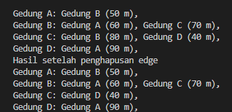

# laporan pertemuan 14 : 

NAMA : Kibar Mustofa<br>
KELAS : TI-1H<br>
NIM : 2341720004<br>
ABSEN : 14<br>

## Percobaan
## 2.1 Percobaan 1: Implementasi Graph menggunakan Linked List :

### Class node
```
package pertemuan15;

 public class Node14{
    int data;
    Node14 prev, next;
    int jarak;

    Node14 (Node14 prev, int data, int jarak, Node14 next) {
        this.prev = prev;
        this.data = data;
        this.next = next;
        this.jarak = jarak;
    }
 }
 ```

 ### class Graph:
 ```
 package pertemuan15.tugas;

public class Graph14 {
    int vertex;
    doubleLL list[];

    public Graph14(int v){
        vertex = v;
        list = new doubleLL[v];
        for (int i = 0; i < v; i++) {
            list[i] = new doubleLL();
        }
    }

    public void addEdge(int asal, int tujuan, int jarak){
        list[asal].addFirst(tujuan, jarak);
    }
    //apabila graf yang dibuat adalah undirected graph, maka tambahkan kode berikut.
    // list[tujuan].addFirst(asal, jarak);

    public void degree(int asal) throws Exception{
        int k, totalIn = 0, totalOut = 0;
        for (int i = 0; i < vertex; i++) {
            //inDegree
            for (int j = 0; j < list[i].size(); j++) {
                if (list[i].get(j) == asal) {
                    ++totalIn;
                }
            }
            //outDegree
            for (k = 0; k < list[asal].size(); k++) {
                list[asal].get(k);
            }
            totalOut = k;
        }
        System.out.println("InDegree dari Gedung " + (char) ('A' +asal) + ": " + totalIn);
        System.out.println("OutDegree dari Gedung " + (char) ('A' +asal) + ": " + totalOut);
        System.out.println("Degree dari Gedung " + (char) ('A' +asal) + ": " + (totalIn + totalOut));

        //Apabila graf yang dibuat adalah undirected graph, maka cukup gunakan kode berikut.
        //System.out.println("Degree dari Gedung " + (char) ('A' + asal) + ": " + list[asal].size());
    }

    public void removeEdge(int asal, int tujuan) throws Exception{
        for (int i = 0; i < vertex; i++) {
            if (i == tujuan) {
                list[asal].remove(tujuan);
            }
        }
    }

    public void removeAllEdge(){
        for (int i = 0; i < vertex; i++) {
            list[i].clear();
        }
    }

    public void printGraph()throws Exception{
        for (int i = 0; i < vertex; i++) {
            if (list[i].size() > 0) {
                System.out.print("Gedung " + (char) ('A' + i) + " terhubung dengan ");
                for (int j = 0; j < list[i].size(); j++) {
                    System.out.print((char) ('A' + list[i].get(j)) + " (" + list[i].getJarak(j) + " m), ");
                }
                System.out.println("");
            }
        }
        System.out.println("");
    }
    public boolean cekEdge(int asal, int tujuan) {
        Node14 current = list[asal].head;
        while (current != null) {
            if (current.data == tujuan) {
                return true;
            }
            current = current.next;
        }
        return false;
    }
    
    public void updateJarak(int asal, int tujuan, int jarak) throws Exception {
        Node14 current = list[asal].head;
        while (current != null) {
            if (current.data == tujuan) {
                current.jarak = jarak;
                return;
            }
            current = current.next;
        }
        throw new Exception("Edge tidak ditemukan");
    }

    public int hitungEdge() {
        int count = 0;
        for (int i = 0; i < vertex; i++) {
            count += list[i].size();
        }
        return count;
    }

} 
 ```
## Class DoubleLinkedList :
```
package pertemuan15.tugas;

public class doubleLL {
    Node14 head;
    int size;

    public doubleLL(){
        head = null;
        size = 0;
    }

    public boolean isEmpty(){
        return head == null;
    }

    public void addFirst(int item, int jarak){
        if (isEmpty()) {
            head = new Node14(null, item, jarak, null);
        } else {
            Node14 newNode = new Node14(null, item, jarak, head);
            head.prev = newNode;
            head = newNode;
        }
        size++;
    }

    public int getJarak(int index)throws Exception{
        if (isEmpty() || index >= size) {
            throw new Exception("NIlai index di luar batas");
        }
        Node14 tmp = head;
        for (int i = 0; i < index; i++) {
            tmp = tmp.next;
        }
        return tmp.jarak;
    }

    public void remove(int index){
       Node14 current = head;
       while (current != null) {
            if (current.data == index) {
                if (current.prev != null) {
                    current.prev.next = current.next;
                } else {
                    head = current.next;
                }
                if (current.next != null) {
                    current.next.prev = current.prev;
                }
                break;
            }
            current = current.next;
       }
        size--;
    }

    public int size(){
        return size;
    }

    public int get(int index)throws Exception{
        if (index >= size) {
            throw new Exception("Nilai index diluar batas");
        }
        Node14 tmp = head;
        for (int i = 0; i < index; i++) {
            tmp = tmp.next;
        }
        return tmp.data;
    }

    public void clear(){
        head = null;
        size = 0;
    }
}
```

### main:
```
package pertemuan15;

public class GraphMain14 {
    public static void main(String[] args) throws Exception {
        Graph14 gedung = new Graph14(6);
        gedung.addEdge(0, 1,50 );
        gedung.addEdge(0, 2, 100);
        gedung.addEdge(1, 3, 70);
        gedung.addEdge(2, 3, 40);
        gedung.addEdge(3, 4, 60);
        gedung.addEdge(4, 5, 80);
        gedung.degree(0);
        gedung.printGraph();
        System.out.println("sesudah hapus edge");
        gedung.removeEdge(1, 3);
        gedung.printGraph();

        
    }
}
```
### hasil output:
 

### pertanyaan:
1. Perbaiki kode program Anda apabila terdapat error atau hasil kompilasi kode tidak sesuai!
2. Pada class Graph, terdapat atribut list[] bertipe DoubleLinkedList. Sebutkan tujuan pembuatan 
variabel tersebut!
- di kode graph14 atribut list[] berfungsi untu menyimpan daftar edges dari setiap vertex pada graph
3. Jelaskan alur kerja dari method removeEdge!
- i. pertama akan dilakukan pengecekan pada method remove adge memiliki  2 para meter asal dan tujuan yang merupakan sebuah indeks dari simpul yang akan di pisah 
ii. loop pada vertex dilakukan dengan iterasi dari 0 hingga vetex -1 untuk mengecek tujuan dari setiap indek
iii. dan untuk penghapusan sesuai dengan jika kondisi if(i == tujuan) maka method remove pada linked list yang terletak di list[asal] dipanggil untuk menghapus elemen yang menyimpan tujuan.

4. Apakah alasan pemanggilan method addFirst() untuk menambahkan data, bukan method add 
jenis lain saat digunakan pada method addEdge pada class Graph?
- karena method addLast() merupakan penambahan di akhir list mungkin memerlukan iterasi sampai ke elemen terakhir, yang bisa membuat operasi lebih lambat dibandingkan addFirst(), terutama jika list sangat panjang.

5. Modifikasi kode program sehingga dapat dilakukan pengecekan apakah terdapat jalur antara 
suatu node dengan node lainnya, seperti contoh berikut (Anda dapat memanfaatkan Scanner)
 
modifikasi class graph:

```
 public boolean isPath(int start, int end) {
        boolean[] visited = new boolean[vertex];
        return dfs(start, end, visited);
    }

    private boolean dfs(int current, int target, boolean[] visited) {
        if (current == target) return true;
        visited[current] = true;
        Node19 tmp = list[current].head;
        while (tmp != null) {
            if (!visited[tmp.data] && dfs(tmp.data, target, visited)) {
                return true;
            }
            tmp = tmp.next;
        }
        return false;
    }
```
modifikasi main:

```
 while (true) {
            System.out.print("Masukkan gedung asal: ");
            int asal = scanner.nextInt();
            System.out.print("Masukkan gedung tujuan: ");
            int tujuan = scanner.nextInt();

            if (gedung.isPath(asal, tujuan)) {
                System.out.println("Gedung " + (char) ('A' + asal) + " dan Gedung " + (char) ('A' + tujuan) + " bertetangga");
            } else {
                System.out.println("Gedung " + (char) ('A' + asal) + " dan Gedung " + (char) ('A' + tujuan) + " tidak bertetangga");
            }

            System.out.print("Apakah Anda ingin melanjutkan? (y/n): ");
            char choice = scanner.next().charAt(0);
            if (choice == 'n' || choice == 'N') {
                break;
            }
        }
```

### percobaan 2: Implementasi Graph menggunakan Matriks

###  kode graph matikrs:
```
package pertemuan15;

public class GraphMatriks14 {
    int vertex;
    int[][] matriks;

    public GraphMatriks14 (int v){
        vertex = v;
        matriks = new int[v][v];
        for (int i = 0; i < v; i++) {
            for (int j = 0; j < v; j++) {
                matriks[i][j] = -1;  // Inisialisasi dengan -1 untuk menunjukkan tidak ada edge
            }
        }
    }

    public void makeEdge(int asal, int tujuan, int jarak){
        matriks[asal][tujuan] = jarak;
    }

    public void removeEdge(int asal, int tujuan){
        matriks[asal][tujuan] = -1;
    }

    public void printGraph() {
        for (int i = 0; i < vertex; i++) {
            System.out.print("Gedung " + (char) ('A' + i) + ": ");
            for (int j = 0; j < vertex; j++) {
                if (matriks[i][j] != -1) {
                    System.out.print("Gedung " + (char) ('A' + j) + " (" + matriks[i][j] + " m), ");
                }
            }
            System.out.println();
        }
    }

    public int outDegree(int v) {
        int degree = 0;
        for (int i = 0; i < vertex; i++) {
            if (matriks[v][i] != -1) {
                degree++;
            }
        }
        return degree;
    }

    public int inDegree(int v) {
        int degree = 0;
        for (int i = 0; i < vertex; i++) {
            if (matriks[i][v] != -1) {
                degree++;
            }
        }
        return degree;
    }

    public int totalDegree(int v) {
        return inDegree(v) + outDegree(v);
    }

    public void printDegrees() {
        for (int i = 0; i < vertex; i++) {
            System.out.println("Gedung " + (char) ('A' + i) + ": inDegree = " + inDegree(i) + ", outDegree = " + outDegree(i) + ", totalDegree = " + totalDegree(i));
        }
    }
}


```

###  main 

```
package pertemuan15;

public class GraphMain14 {
    public static void main(String[] args) throws Exception {
        Graph14 gedung = new Graph14(6);
        gedung.addEdge(0, 1,50 );
        gedung.addEdge(0, 2, 100);
        gedung.addEdge(1, 3, 70);
        gedung.addEdge(2, 3, 40);
        gedung.addEdge(3, 4, 60);
        gedung.addEdge(4, 5, 80);
        gedung.degree(0);
        gedung.printGraph();
        System.out.println("sesudah hapus edge");
        gedung.removeEdge(1, 3);
        gedung.printGraph();

        GraphMatriks14 gdg = new GraphMatriks14(4);
        gdg.makeEdge(0, 1, 50);
        gdg.makeEdge(1, 0, 60);
        gdg.makeEdge(1, 2, 70);
        gdg.makeEdge(2, 1, 80);
        gdg.makeEdge(2, 3, 40);
        gdg.makeEdge(3, 0, 90);
        gdg.printGraph();
        System.out.println("Hasil setelah penghapusan edge");
        gdg.removeEdge(2, 1);
        gdg.printGraph();
    }
}

```
### hasil output:
 

### pertanyaan:
1. Perbaiki kode program Anda apabila terdapat error atau hasil kompilasi kode tidak sesuai!

2. Apa jenis graph yang digunakan pada Percobaan 2?

jawab: Pada percobaan kali ini, jenis graf yang digunakan adalah directed graph

Apa maksud dari dua baris kode berikut?

gdg.makeEdge(1, 2, 70);
gdg.makeEdge(2, 1, 80);

jawab: Maksud dari dua baris kode diatas adalah menunjukkan bahwa dua edge dibuat dalam graf yang ada

Modifikasi kode program sehingga terdapat method untuk menghitung degree, termasuk inDegree dan outDegree!

jawab:

public int outDegree(int v) {
    int degree = 0;
    for (int i = 0; i < vertex; i++) {
        if (matriks[v][i] != -1) {
            degree++;
        }
    }
    return degree;
}

public int inDegree(int v) {
    int degree = 0;
    for (int i = 0; i < vertex; i++) {
        if (matriks[i][v] != -1) {
            degree++;
        }
    }
    return degree;
}

public int totalDegree(int v) {
    return inDegree(v) + outDegree(v);
}

public void printDegrees() {
    for (int i = 0; i < vertex; i++) {
        System.out.println("Gedung " + (char) ('A' + i) + ": inDegree = " + inDegree(i) + ", outDegree = " + outDegree(i) + ", totalDegree = " + totalDegree(i));
    }
}
### tugas 
Modifikasi kode program pada class GraphMain sehingga terdapat menu program yang bersifat dinamis, setidaknya terdiri dari:

a) Add Edge
b) Remove Edge
c) Degree
d) Print Graph
e) Cek Edge
Pengguna dapat memilih menu program melalui input Scanner

```
package pertemuan15.tugas;

import java.util.Scanner;

public class GraphMain14 {
    public static void main(String[] args) {
        Scanner sc = new Scanner(System.in);
        System.out.print("Masukkan jumlah vertex: ");
        int v = sc.nextInt();
        Graph14 graph = new Graph14(v);

        boolean exit = false;
        while (!exit) {
            System.out.println("Menu:");
            System.out.println("1. Add Edge");
            System.out.println("2. Remove Edge");
            System.out.println("3. Degree");
            System.out.println("4. Print Graph");
            System.out.println("5. Cek Edge");
            System.out.println("6. Update Jarak");
            System.out.println("7. Hitung Edge");
            System.out.println("8. Exit");
            System.out.print("Pilih menu: ");
            int choice = sc.nextInt();

            switch (choice) {
                case 1:
                    System.out.print("Masukkan asal: ");
                    int asal = sc.nextInt();
                    System.out.print("Masukkan tujuan: ");
                    int tujuan = sc.nextInt();
                    System.out.print("Masukkan jarak: ");
                    int jarak = sc.nextInt();
                    graph.addEdge(asal, tujuan, jarak);
                    break;
                case 2:
                    System.out.print("Masukkan asal: ");
                    asal = sc.nextInt();
                    System.out.print("Masukkan tujuan: ");
                    tujuan = sc.nextInt();
                    try {
                        graph.removeEdge(asal, tujuan);
                    } catch (Exception e) {
                        System.out.println(e.getMessage());
                    }
                    break;
                case 3:
                    System.out.print("Masukkan vertex: ");
                    asal = sc.nextInt();
                    try {
                        graph.degree(asal);
                    } catch (Exception e) {
                        System.out.println(e.getMessage());
                    }
                    break;
                case 4:
                    try {
                        graph.printGraph();
                    } catch (Exception e) {
                        System.out.println(e.getMessage());
                    }
                    break;
                case 5:
                    System.out.print("Masukkan asal: ");
                    asal = sc.nextInt();
                    System.out.print("Masukkan tujuan: ");
                    tujuan = sc.nextInt();
                    if (graph.cekEdge(asal, tujuan)) {
                        System.out.println("Edge ada");
                    } else {
                        System.out.println("Edge tidak ada");
                    }
                    break;
                case 6:
                    System.out.print("Masukkan asal: ");
                    asal = sc.nextInt();
                    System.out.print("Masukkan tujuan: ");
                    tujuan = sc.nextInt();
                    System.out.print("Masukkan jarak baru: ");
                    jarak = sc.nextInt();
                    try {
                        graph.updateJarak(asal, tujuan, jarak);
                    } catch (Exception e) {
                        System.out.println(e.getMessage());
                    }
                    break;
                case 7:
                    System.out.println("Jumlah edge: " + graph.hitungEdge());
                    break;
                case 8:
                    exit = true;
                    break;
                default:
                    System.out.println("Pilihan tidak valid");
                    break;
            }
        }
        sc.close();
    }
}

```

2. Tambahkan method updateJarak pada Percobaan 1 yang digunakan untuk mengubah jarak antara dua node asal dan tujuan!

jawab:
```
public void updateJarak(int asal, int tujuan, int jarakBaru) throws Exception {
    list[asal].updateJarak(tujuan, jarakBaru);
}
```
3. ambahkan method hitungEdge untuk menghitung banyaknya edge yang terdapat di dalam graf!

jawab:
```
public int hitungEdge() {
    int totalEdges = 0;
    for (int i = 0; i < vertex; i++) {
        totalEdges += list[i].size();  
    }
    return totalEdges;
}  
```  