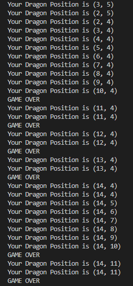

# Laporan praktikum pertemuan 2

NAMA : Kibar Mustofa<br>
KELAS : TI-1H<br>
NIM : 2341720004<br>
ABSEN : 14<br>

## 2.1 Percobaan 1: Deklarasi Class, Atribut dan Method

buat class buku
setelah itu inisialisasi
Buka text editor.
1. Buat file baru, beri nama Buku<NoAbsen>.java
2. Lengkapi class Buku dengan atribut yang telah digambarkan di dalam class diagram tersebut


3. Lengkapi class Buku dengan method yang telah digambarkan di dalam class diag


### 2.1.2 pertanyaan

1. Sebutkan dua karakteristik class atau object!
- atribut dan behavior
2. Perhatikan class Buku pada Praktikum 1 tersebut, ada berapa atribut yang dimiliki oleh class 
Buku? Sebutkan apa saja atributnya!
- judul: String, pengarang: String, halaman: int, stok: int,
harga: int
3. Ada berapa method yang dimiliki oleh class tersebut? Sebutkan apa saja methodnya!
- ada 4 yang berupa, tampilInformasi(): void,
terjual(jml: int): void,
restock(n: int): void,
gantiHarga(hrg: int): int,
4. Perhatikan method terjual() yang terdapat di dalam class Buku. Modifikasi isi method tersebut 
sehingga proses pengurangan hanya dapat dilakukan jika stok masih ada (lebih besar dari 0)!

void terjual(int jml) {
        if (stok >= jml) {
            stok -= jml;
        }else{
            System.out.println("stock berlebih dari penjualan");
        }
    }

5. Menurut Anda, mengapa method restock() mempunyai satu parameter berupa bilangan int?
- parameter tersebut digunakan untuk mengetahui jumlah buku saat ini. Dan kenapa int, sebab tipedata jumlah juga merupakan int

## Percobaan 2: Instansiasi Object, serta Mengakses Atribut dan Method

 2.2.1 Langkah-langkah Percobaan
1. Buat file baru, beri nama BukuMain<NoAbsen>.java
2. Tuliskan struktur dasar bahasa pemrograman Java yang terdiri dari fungsi main()
3. Di dalam fungsi main(), lakukan instansiasi, kemudian lanjutkan dengan mengakses atribut dan 
method dari objek yang telah terbentuk.

### hasil output main:


## 2.2.3 Pertanyaan
1. Pada class BukuMain, tunjukkan baris kode program yang digunakan untuk proses instansiasi!
 ```
    Buku bk2 = new Buku("Self Reward", "Maheera Ayesha", 160, 59000);
    
```
Apa nama object yang dihasilkan?
Object:

```     
        bk1.judul = "Today Ends Tomorrow Comes";
        bk1.pengarang = "Denanda Pratiwi";
        bk1.halaman = 198;
        bk1.stok = 13;
        bk1.harga = 71000;
        
```
2. Bagaimana cara mengakses atribut dan method dari suatu objek?
sebagi contoh :  
bk1.judul = "Today Ends Tomorrow Comes"; // sebagai kode agar dapat menggunakan atau memperoleh atribut judul
 bk1.tampilInformasi(); // digunakan untuk memanggil method tampilInformasi()

3. Mengapa hasil output pemanggilan method tampilInformasi() pertama dan kedua berbeda?
- Hasil output berbeda karena perbedaan nilai atribut dari objek pada pemanggilan pertama dan kedua

## 2.3 Percobaan 3: Membuat Konstruktor

2.3.1 Langkah-langkah Percobaan
1. Buka kembali class Buku. Tambahkan dua buah konstruktor di dalam class Buku tersebut, yang 
terdiri dari satu konstruktor default dan satu konstruktor berparameter. Konstruktor merupakan 
method Istimewa, penempatan kode program untuk konstruktor dapat diperlakukan sama 
seperti method yang lain (setelah atribut)


2. Buka kembali class BukuMain. Buat sebuah object lagi bernama bk2 dengan menggunakan 
konstruktor berparameter.


### hasil output percobaan


2.3.3 Pertanyaan
1. Pada class Buku di Percobaan 3, tunjukkan baris kode program yang digunakan untuk 
mendeklarasikan konstruktor berparameter!

```
public Buku14(String jud, String PE, int hal, int stok, int har  ){
        judul = jud; 
        pengarang = PE;
        halaman = hal;
        this.stok = stok;
        harga = har; 
    }
```
2. Perhatikan class BukuMain. Apa sebenarnya yang dilakukan pada baris program berikut?


- kode tersebut digunakan untuk melakukan instansiasi untuk bk2 dari kelas berparameter

3. Hapus konstruktor default pada class Buku, kemudian compile dan run program. Bagaimana 
hasilnya? Jelaskan mengapa hasilnya demikian!
- Jika konstruktor default dihapus maka akan terjadi error akibat tidak ada konstruktor tanpa parameter yang tersedia untuk digunakan saat membuat objek.


4. Setelah melakukan instansiasi object, apakah method di dalam class Buku harus diakses 
secara berurutan? Jelaskan alasannya!
- tidak perlu karena akan disesuaikan setelah melakukan instansiasi
5. Buat object baru dengan nama buku<NamaMahasiswa> menggunakan konstruktor 
berparameter dari class Buku!
```
 Buku14 BukuKibar = new Buku14("Sherlock Holmes", "Arthur Conan Doyle", 700, 30, 129000);

```
## 2.4 Latihan Praktikum

### hasil kode praktikum 1:
1. kode class Buku14:
```
public class Buku14 {
    String judul, pengarang;
    int halaman, stok, harga;

    void tampilInformasi(){
        System.out.println("Judul: " + judul);
        System.out.println("Pengarang: " + pengarang);
        System.out.println("Jumlah halaman: " + halaman);
        System.out.println("Sisa stok: " + stok);
        System.out.println("Harga: Rp " + harga);
        
        int hargaTotal = hitungHargaTotal(stok);
        System.out.println("Harga Total: Rp " + hargaTotal);
        
        double diskon = hitungDiskon(hargaTotal);
        System.out.println("Diskon: " + (diskon * 100) + "%");
        
        double hargaBayar = hitungHargaBayar(hargaTotal, diskon);
        System.out.println("Harga Bayar: Rp " + hargaBayar);
    }

    public Buku14() {
        
    }
    public Buku14(String jud, String PE, int hal, int stok, int har  ){
        judul = jud; 
        pengarang = PE;
        halaman = hal;
        this.stok = stok;
        harga = har; 
    }
    void terjual(int jml) {
        if (stok >= jml) {
            stok -= jml;
        }else{
            System.out.println("stock berlebih dari penjualan");
        }
    }
    
    void restock(int jml){
        stok += jml;
    }
    void gantiHarga(int hrg) {
        harga = hrg;
    }
    int hitungHargaTotal(int jmlBukuTerjual) {
        return harga * jmlBukuTerjual;
    }

    double hitungDiskon(int hargaTotal) {
        if (hargaTotal > 150000) {
            return 0.12; 
        } else if (hargaTotal >= 75000 && hargaTotal <= 150000) {
            return 0.05; 
        } else {
            return 0; 
        }
    }

    double hitungHargaBayar(int hargaTotal, double diskon) {
        return hargaTotal - (hargaTotal * diskon);
    }
}

```
2. kode main BukuMain14:
```
public class BukuMain14 {
    public static void main(String[] args) {
       Buku14 bk1 = new Buku14 ();
       bk1.judul = "Today Ends Tomorrow Comes";
       bk1.pengarang = "Denada Pratiwi";
       bk1.halaman = 198;
       bk1.stok = 13;
       bk1.harga = 71000;

       bk1.tampilInformasi();
       bk1.terjual(5);
       bk1.gantiHarga(60000);
       bk1.tampilInformasi();
       bk1.hitungHargaTotal(10);
       bk1.hitungDiskon(0);
       bk1.hitungHargaBayar(0, 0);


       Buku14 bk2 = new Buku14("Self Reward", "Maheera Ayesha", 160, 29, 59000 );
       bk2.terjual(11);
       bk2.tampilInformasi();
       
       Buku14 BukuKibar = new Buku14("Sherlock Holmes", "Arthur Conan Doyle", 700, 30, 129000);
       BukuKibar.tampilInformasi();

    }
}
```
### Hasil Output:


### hasil kode praktikum 2:
1. kode class Dragon14:

```
public class Dragon14 {

    int x, y, width, height;

    void moveLeft() {
        x -= 1;
        if (x < 0) {
            detectCollision(x, y);
        }
    }

    void moveRight() {
        x += 1;
        if (x > width) {
            detectCollision(x, y);
        }
    }

    void moveUp() {
        y -= 1;
        if (y < 0) {
            detectCollision(x, y);
        }
    }

    void moveDown() {
        y += 1;
        if (y > height) {
            detectCollision(x, y);
        }
    }

    void printPosition() {
        System.out.println("Your Dragon Position is (" + x + ", " + y + ")");
    }

    void detectCollision(int x, int y) {
        System.out.println("GAME OVER");
        System.out.println("Your Dragon Position is (" + x + ", " + y + ")");
    }

    public Dragon14(int horizontal, int vertical, int mapWidth, int mapHeight) {
        x = horizontal;
        y = vertical;
        width = mapWidth;
        height = mapHeight;
    }
}
```
2. kode main DragonMain14:

```
public class DragonMain14 {
    public static void main(String[] args) {
        Dragon14 dragon = new Dragon14(3, 5, 10, 10);

        dragon.printPosition();

        dragon.moveLeft();
        dragon.printPosition();

        dragon.moveUp();
        dragon.printPosition();

        for (int i = 0; i < 12; i++) {
            dragon.moveRight();
            dragon.printPosition();
        }
        for (int i = 0; i < 12; i++) {
            dragon.moveDown();
            dragon.printPosition();
        }
    }
}
```
### Hasil Output:

