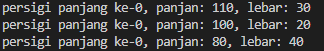
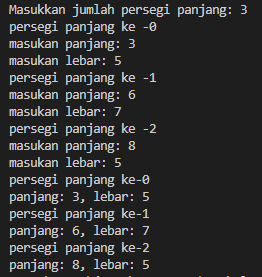
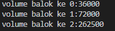
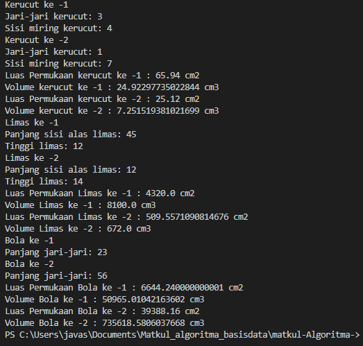
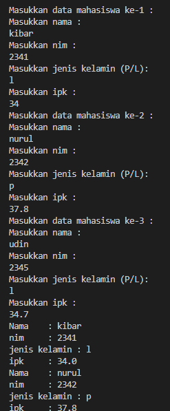

# laporan pertemuan 3 : array of objects

NAMA : Kibar Mustofa<br>
KELAS : TI-1H<br>
NIM : 2341720004<br>
ABSEN : 14<br>

## percobaan 1 :Membuat Array dari Object, Mengisi dan Menampilkan
berikut adalah tampilan kode dari percobaan 1 
### hasil kode percobaan 1
#### class:
```
public class ArrayObjects {
    public static void main(String[] args) {
        persegiPanjang[] ppArray = new persegiPanjang[3]; 
        ppArray[0] = new persegiPanjang();
        ppArray[0].panjang = 110;
        ppArray[0].lebar = 30;
    
        ppArray[1] = new persegiPanjang();
        ppArray[1].panjang = 80;
        ppArray[1].lebar = 40;
    
        ppArray[2] = new persegiPanjang();
        ppArray[2].panjang = 100;
        ppArray[2].lebar = 20;
    
        System.out.println("persigi panjang ke-0, panjan: "+ ppArray[0].panjang + ", lebar: " + ppArray[0].lebar);
        System.out.println("persigi panjang ke-0, panjan: "+ ppArray[2].panjang + ", lebar: " + ppArray[2].lebar);
        System.out.println("persigi panjang ke-0, panjan: "+ ppArray[1].panjang + ", lebar: " + ppArray[1].lebar);
    }
}
```
#### main:
```

public class persegiPanjang {
    public int panjang;
    public int lebar;
}
```
### hasil tampilan output:



## pertanyaan
1. Berdasarkan uji coba 3.2, apakah class yang akan dibuat array of object harus selalu memiliki 
atribut dan sekaligus method?Jelaskan!
- Tidak selalu class yang akan dibuat menjadi array of object memiliki atribut dan method. Jika class yang akan dibuat menjadi array of object tidak membutuhkan atribut dan method, maka tidak perlu menambahkannya.
2. Apakah class PersegiPanjang memiliki konstruktor?Jika tidak, kenapa dilakukan pemanggilan konstruktur pada baris program berikut :
```
ppArray[1]=new PersegiPanjang()
```
- class PersegiPanjang memiliki kontruktor default sehingga tetap perlu melakukan pemanggilan, Pada saat akan objek dibuat, program akan menginisialisasi objek dengan nilai default untuk tipe data yang sesuai.

3. Apa yang dimaksud dengan kode berikut ini:
```
ppArray[1] = new PersegiPanjang[3];

```
-  merupakan deklarasi dan inisialisasi sebuah array dari objek-objek PersegiPanjang.
4. Apa yang dimaksud dengan kode berikut ini:
```
ppArray[1]=new PersegiPanjang(); 
ppArray[1].panjang = 80; 
ppArray[1].lebar = 40;

```
- baris kode pertama digunakan untuk membuat sebuah array objek PersegiPanjang
- baris kode ke 2 digunakan untuk mengatur nilai panjang dari objek pertama di dalam array yang disimpan di indeks 1
- baris kode ke 3 digunakan untuk mengatur nilai lebar dari objek pertama di dalam array yang disimpan di indeks 1
5. Mengapa class main dan juga class PersegiPanjang dipisahkan pada uji coba 3.2?
- Karena Class Persegi panjang digunakan untuk pembuatan konstructor objek yang berada pada Class Main
## Percobaan 2: Menerima Input Isian Array Menggunakan Looping
### hasil kode percobaan 2
### class:
```
import java.util.Scanner;
public class ArrayObjects {
    public static void main(String[] args) {
        persegiPanjang[] ppArray = new persegiPanjang[3]; 
        
        Scanner sc = new Scanner(System.in);

        for (int i = 0; i < 3; i++){
            ppArray[i] = new persegiPanjang();
            System.out.println("persegi panjang ke -" + i );
            System.out.print("masukan panjang: " );
            ppArray[i].panjang = sc.nextInt();
            System.out.print("masukan lebar: " );
            ppArray[i].lebar = sc.nextInt();
        }

        for (int i = 0; i < 3; i++ ){
            System.out.println("persegi panjang ke-"+ i );
            System.out.println("panjang: "+ ppArray[i].panjang + ", lebar: " + ppArray[i].lebar );
        }
    }
}
```
### hasil 


## pertanyaan 
1. Apakah array of object dapat diimplementasikan pada array 2 Dimensi?
2. Jika jawaban soal no satu iya, berikan contohnya! Jika tidak, jelaskan!
3. Jika diketahui terdapat class Persegi yang memiliki atribut sisi bertipe integer, maka kode dibawah ini akan memunculkan error saat dijalankan. Mengapa? Persegi [] pgArray = new Persegi[100]; pgArray[5].sisi = 20;
dibawah ini akan memunculkan error saat dijalankan. Mengapa?
- karena pada class persegi tidak di definisikan oleh karena itu program akan menjadi error

4. Modifikasi kode program pada praktikum 3.3 agar length array menjadi inputan dengan Scanner!
- hasil kode adalah sebagi berikut:
```
  System.out.print("Masukkan jumlah persegi panjang: ");
        int jumlahPersegiPanjang = sc.nextInt();
        persegiPanjang[] ppArray = new persegiPanjang[jumlahPersegiPanjang];
        
        for (int i = 0; i < jumlahPersegiPanjang; i++){
```
5. Apakah boleh Jika terjadi duplikasi instansiasi array of objek, misalkan saja instansiasi dilakukan 
pada ppArray[i] sekaligus ppArray[0]?Jelaskan !
- bisa dan dapat di inisialisasi dari ppArray[0] ke ppArray[i], tetapi keduanya akan menunjuk ke objek yang sama
### hasil percobaan 3: Penambahan Operasi Matematika di Dalam Method
#### class:
```
public class Balok {
    public int panjang;
    public int lebar;
    public int tinggi;
    
    public Balok(int p, int l, int t){
        panjang = p;
        lebar = l;
        tinggi = t;
    }
    public int hitungVolume(){
        return panjang * lebar * tinggi;
    } 
}
```
#### main:
```
public class ArrayBalok{
    public static void main(String[] args) {
        Balok[] blArray = new Balok[3]; 
        blArray[0] = new Balok(100,30,12);
        blArray[1] = new Balok(120,40,15);
        blArray[2] = new Balok(210,50,25);

        for (int i = 0; 1 < 3; i++){
            System.out.println("volume balok ke "+ i + ":" +blArray[i].hitungVolume());
        }
    }
}
```
### hasil tampilan output:



## pertanyaan 

1. Dapatkah konstruktor berjumlah lebih dalam satu kelas? Jelaskan dengan contoh!
- bisa contoh sebagai berikut
```
 public Balok(int p, int l, int t){
        panjang = p;
        lebar = l;
        tinggi = t;
    }
```
2. Jika diketahui terdapat class Segitiga seperti berikut ini:
```
public class segitiga {
    public int alas;
    public int tinggi;
}
```
    Tambahkan konstruktor pada class Segitiga tersebut yang berisi parameter int a, int tyang masing-masing digunakan untuk mengisikan atribut alas dan tinggi.
- kode sebagai berikut
```
public segitiga(int a, int t) {
        alas = a;
        tinggi = t;
    }
```
3. Tambahkan method hitungLuas() dan hitungKeliling() pada class Segitiga tersebut. Asumsi segitiga adalah segitiga siku-siku. (Hint: Anda dapat menggunakan bantuan library Math pada Java untuk mengkalkulasi sisi miring)

```
public double hitungLuas() {
        return 0.5 * alas * tinggi;
    }

    public double hitungKeliling() {
        double sisiMiring = Math.sqrt(alas * alas + tinggi * tinggi);
        return alas + tinggi + sisiMiring;
    }
```
4. Pada fungsi main, buat array Segitiga sgArray yang berisi 4 elemen, isikan masing-masing atributnya sebagai berikut: sgArray ke-0 alas: 10, tinggi: 4 sgArray ke-1 alas: 20, tinggi: 10 sgArray ke-2 alas: 15, tinggi: 6 sgArray ke-3 alas: 25, tinggi: 10
- kode sebagai berikut:
```
 segitiga[] sgArray = new segitiga[4];

        sgArray[0] = new segitiga(10, 4);
        sgArray[1] = new segitiga(20, 10);
        sgArray[2] = new segitiga(15, 6);
        sgArray[3] = new segitiga(25, 10);
```
5. Kemudian menggunakan looping, cetak luas dan keliling dengan cara memanggil method hitungLuas() dan hitungKeliling().
- kode sebagai berikut:
```
 for (int i = 0; i < sgArray.length; i++) {
            System.out.println("segitiga ke-" + i);
            System.out.println("luas: " + sgArray[i].hitungLuas());
            System.out.println("keliling: " + sgArray[i].hitungKeliling());
        }
```

## Latihan paktikum 1 :
kode:
#### class:
- class kerucut  
```
class Kerucut {
    public int jariJari;
    public int sisiMiring;
    public double phi = 3.14;
   
    public Kerucut(int r, int s) {
        jariJari = r;
        sisiMiring = s;
    }

    public double tinggiKerucut() {
        double t = Math.sqrt(sisiMiring * sisiMiring - jariJari * jariJari);
        return t;
    }

    public double LuasPKerucut() {
        return phi * jariJari * sisiMiring + phi * jariJari * jariJari;
    }
    public double VolumKerucut() {
        return ((phi * jariJari * jariJari) * tinggiKerucut()) / 3;
    }
}
```
- class limas
```
class Limas {
    public int sisi;
    public int tinggi;

    public double LuasPLimas() {
        double tinggiStegak = Math.sqrt((0.5 * sisi) * (0.5 * sisi) + tinggi * tinggi);
        double luasStegak = (0.5 * sisi * tinggiStegak);
        return (sisi * sisi) + (4 * luasStegak);
    }

    public double VolumLimas() {
        return ((sisi * sisi) * tinggi) / 3;
    }

}
```

- class bola
```
class Bola {
    public int jariJari;

    public double LuasPBola() {
        return 4 * 3.14 * (jariJari * jariJari);
    }

    public double VolumBola() {
        return Math.PI * (jariJari * jariJari * jariJari) * 4 / 3;
    }

}
```
#### main:

```
import java.util.Scanner;

public class bangunRuangMain {
    public static void main(String[] args) {
        Scanner sc = new Scanner(System.in);
        
        System.out.print("Masukkan jumlah bangun : ");
        int jumlahBangun = sc.nextInt();
       
        Kerucut[] ker = new Kerucut[jumlahBangun];
        for (int j = 0; j < jumlahBangun; j++) {
            System.out.println("Kerucut ke -" + (j + 1));
            System.out.print("Jari-jari kerucut: ");
            int r = sc.nextInt();
            System.out.print("Sisi miring kerucut: ");
            int s = sc.nextInt();
            ker[j] = new Kerucut(r, s);
        }

        for (int j = 0; j < jumlahBangun; j++) {
            System.out.println("Luas Permukaan kerucut ke -" + (j + 1) + " : " + ker[j].LuasPKerucut() + " cm2");
            System.out.println("Volume kerucut ke -" + (j + 1) + " : " + ker[j].VolumKerucut() + " cm3");
        }

        Limas[] lim = new Limas[jumlahBangun];
        for (int j = 0; j < jumlahBangun; j++) {
            lim[j] = new Limas();

            System.out.println("Limas ke -" + (j + 1));
            System.out.print("Panjang sisi alas limas: ");
            lim[j].sisi = sc.nextInt();
            System.out.print("Tinggi limas: ");
            lim[j].tinggi = sc.nextInt();
        }

        for (int j = 0; j < jumlahBangun; j++) {
            System.out.println("Luas Permukaan Limas ke -" + (j + 1) + " : " + lim[j].LuasPLimas() + " cm2");
            System.out.println("Volume Limas ke -" + (j + 1) + " : " + lim[j].VolumLimas() + " cm3");
        }

        Bola[] ball = new Bola[jumlahBangun];
        for (int j = 0; j < jumlahBangun; j++) {
            ball[j] = new Bola();

            System.out.println("Bola ke -" + (j + 1));
            System.out.print("Panjang jari-jari: ");
            ball[j].jariJari = sc.nextInt();
        }

        for (int j = 0; j < jumlahBangun; j++) {
            System.out.println("Luas Permukaan Bola ke -" + (j + 1) + " : " + ball[j].LuasPBola() + " cm2");
            System.out.println("Volume Bola ke -" + (j + 1) + " : " + ball[j].VolumBola() + " cm3");
        }
    }
}

```
## hasil tampilan output:



## Latihan paktikum 2 :

#### class:
```
public class Mahasiswa {
    String nama;
    Long nim;
    double ipk;
    char jenisKelamin;

    public Mahasiswa() {   
    }
}
```

#### main:
```
import java.util.Scanner;
public class MahasiswaMain {
    public static void main(String[] args) {
        Scanner sc = new Scanner(System.in);
        Mahasiswa [] mhs = new Mahasiswa[3];
        for (int i = 0; i < 3; i++) {
            mhs[i] = new Mahasiswa();
            System.out.println("Masukkan data mahasiswa ke-" + (i+1) + " : ");
            System.out.println("Masukkan nama : ");
            mhs[i].nama = sc.next();
            System.out.println("Masukkan nim : ");
            mhs[i].nim = sc.nextLong();
            System.out.println("Masukkan jenis kelamin (P/L): ");
            mhs[i].jenisKelamin = sc.next().charAt(0);
            System.out.println("Masukkan ipk : ");
            mhs[i].ipk = sc.nextDouble();
        }
        
        for (int i = 0; i < 3; i++) {
            System.out.println("Nama\t: " + mhs[i].nama + "\nnim\t: " + mhs[i].nim + "\njenis kelamin : " + mhs[i].jenisKelamin + "\nipk\t: " + mhs[i].ipk);
        }
    }
}
```
## hasil tampilan output:


## Latihan paktikum 3 :

#### main:
```
import java.util.Scanner;
public class MahasiswaMain {
    public static void main(String[] args) {
        Scanner sc = new Scanner(System.in);
        Mahasiswa [] mhs = new Mahasiswa[3];
        for (int i = 0; i < 3; i++) {
            mhs[i] = new Mahasiswa();
            System.out.println("Masukkan data mahasiswa ke-" + (i+1) + " : ");
            System.out.println("Masukkan nama : ");
            mhs[i].nama = sc.next();
            System.out.println("Masukkan nim : ");
            mhs[i].nim = sc.nextLong();
            System.out.println("Masukkan jenis kelamin (P/L): ");
            mhs[i].jenisKelamin = sc.next().charAt(0);
            System.out.println("Masukkan ipk : ");
            mhs[i].ipk = sc.nextDouble();
        }
        
        for (int i = 0; i < 3; i++) {
            System.out.println("Nama\t: " + mhs[i].nama + "\nnim\t: " + mhs[i].nim + "\njenis kelamin : " + mhs[i].jenisKelamin + "\nipk\t: " + mhs[i].ipk);
        }
   
        for (int i = 0; i < 3; i++) {
            System.out.println("Nama\t: " + mhs[i].nama + "\nnim\t: " + mhs[i].nim + "\njenis kelamin : " + mhs[i].jenisKelamin + "\nipk\t: " + mhs[i].ipk);
        }
    
        for (int i = 0; i < 3; i++) {
            System.out.println("Data Mahasiswa ke-"+(i+1));
            System.out.println("Nama : " +mhs[i].nama + "\nNim : " + mhs[i].nim + "\nJenis Kelamin : " + mhs[i].jenisKelamin + "\nIpk : "+mhs[i].ipk);
        }
    
        System.out.println("Rata - Rata IPK Mahasiswa : " + rataRataIpk(mhs));
        System.out.println("Mahasiswa Dengan Nilai IPK Tertinggi "+"\nNama : " + ipktertinggi(mhs).nama + "\nNim : " + ipktertinggi(mhs).nim + "\nJenis kelamin : " + ipktertinggi(mhs).jenisKelamin + "\nIPK : " + ipktertinggi(mhs).ipk);
        }
    
    
        static double rataRataIpk (Mahasiswa[]mhs){
            double totalIpk = 0;
            for (int i = 0; i < 3; i++) {
                totalIpk += mhs[i].ipk;
            }
            return totalIpk / 3;
        }
    
        static Mahasiswa ipktertinggi (Mahasiswa[]mhs){
            Mahasiswa ipkTertinggi = mhs[0];
            for (int i = 0; i < 3; i++) {
                if (mhs[i].ipk > ipkTertinggi.ipk) {
                    ipkTertinggi = mhs[i];
                }
            }
            return ipkTertinggi;
        }
    }
```