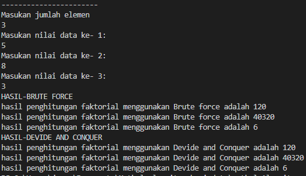
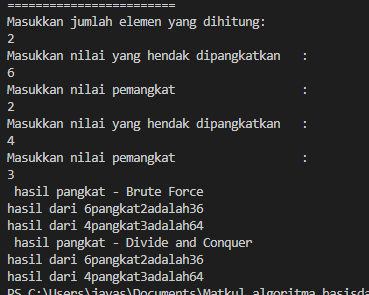
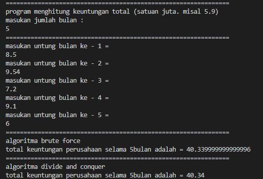
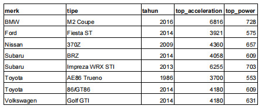

# laporan pertemuan 3 : array of objects

NAMA : Kibar Mustofa<br>
KELAS : TI-1H<br>
NIM : 2341720004<br>
ABSEN : 14<br>

## percobaan 1 : 4.2 Menghitung Nilai Faktorial dengan Algoritma Brute Force dan Divide and Conquer
### hasil kode yang diperoleh dari percobaan 1

### kode class
```
package pertemuan5;

public class faktorial {
   public int nilai;

   int faktorialbf(int n){
    int fakto = 1;
    for(int i= 1; i <=n; i++){
        fakto = fakto * i;
    }
    return fakto;
   } 
   int faktorialdc(int n){
    if (n==1){
        return 1;
    }else{
        int fakto =n * faktorialdc(n-1);
        return fakto;
    }
   }
}
```
### kode main

```
package pertemuan5;

import java.util.Scanner;

public class mainfaktorial {
    public static void main(String[] args) {
        Scanner sc = new Scanner(System.in);
        System.out.println("-----------------------");
        System.out.println("Masukan jumlah elemen ");
        int ijml = sc.nextInt();

        faktorial[] fk = new faktorial[ijml]; 
        for (int i = 0; i < ijml; i++) {
            fk[i] = new faktorial();
            System.out.println("Masukan nilai data ke- " + (i + 1) + ":");
            int iNilai = sc.nextInt();
            fk[i].nilai = iNilai; 
        }
        
        System.out.println("HASIL-BRUTE FORCE");
        for (int i = 0; i < ijml; i++) {
            System.out.println("hasil penghitungan faktorial menggunakan Brute force adalah " + fk[i].faktorialbf(fk[i].nilai));
        }

        System.out.println("HASIL-DEVIDE AND CONQUER");
        for (int i = 0; i < ijml; i++) {
            System.out.println("hasil penghitungan faktorial menggunakan Devide and Conquer adalah " + fk[i].faktorialdc(fk[i].nilai));
        }
        sc.close();
    }
}
```
### hasil tapilan kode ketika di jalankan



### pertanyaan:

1. Pada base line Algoritma Divide Conquer untuk melakukan pencarian nilai faktorial, jelaskan 
perbedaan bagian kode pada penggunaan if dan else!
- if (n==1) digunakan saat kondisi variable n bernilai sama dengan 1 terpenuhi maka return nilai 1. Sementara else digunakan saat kondisi n==1 tidak terpenuhi dan akan melakukan faktorisasi dengan return nilai variable fakto.

2. Apakah memungkinkan perulangan pada method faktorialBF() dirubah selain menggunakan 
for?Buktikan! dapat menggunakn while dengan kode berikut 
- 
```
int fakto = 1;
int i = 1;

while (i <= n) {
    fakto *= i;
    i++;
}

return fakto;
```
3. Jelaskan perbedaan antara fakto *= i; dan int fakto = n * faktorialDC(n-1); !
- fakto *= i; digunakan untuk menghitung iteratif dengan mengalikan fakto dengan nilai 1 hingga mencapai nilai n 
- int fakto = n * faktorialDC(n-1); digunakan untuk cara rekursif menghitung faktorial dengan mengalikan n ke nilai faktorial (n-1)sehingga pada akhirnya "n=0" 

## percobaan 2: 4.3 Menghitung Hasil Pangkat dengan Algoritma Brute Force dan Divide and Conquer

### kode class:
```
package pertemuan5;

public class pangkat {
    public int nilai, pangkat;

    pangkat (int nilai, int pangkat){
        this.nilai = nilai;
        this.pangkat = pangkat;
    }

    int pangkatBF(int a, int n) {
        int hasil = 1;
        for (int i = 0; i < n; i++) {
            hasil *= a;
        }
        return hasil;
    }

    int pangkatDC(int a, int n) {
        if (n == 0) {
            return 1;
        } else {
            if (n % 2 == 1) {
                return (pangkatDC(a, n / 2) * pangkatDC(a, n / 2) * a);
            } else {
                return (pangkatDC(a, n / 2) * pangkatDC(a, n / 2));
            }
        }
    }

}
``` 
### kode main
```
package pertemuan5;

import java.util.Scanner;

public class mainfaktorial {
    public static void main(String[] args) {
        Scanner sc = new Scanner(System.in);
        System.out.println("-----------------------");
        System.out.println("Masukan jumlah elemen ");
        int ijml = sc.nextInt();

        faktorial[] fk = new faktorial[ijml]; 
        for (int i = 0; i < ijml; i++) {
            fk[i] = new faktorial();
            System.out.println("Masukan nilai data ke- " + (i + 1) + ":");
            int iNilai = sc.nextInt();
            fk[i].nilai = iNilai; 
        }
        
        System.out.println("HASIL-BRUTE FORCE");
        for (int i = 0; i < ijml; i++) {
            System.out.println("hasil penghitungan faktorial menggunakan Brute force adalah " + fk[i].faktorialbf(fk[i].nilai));
        }

        System.out.println("HASIL-DEVIDE AND CONQUER");
        for (int i = 0; i < ijml; i++) {
            System.out.println("hasil penghitungan faktorial menggunakan Devide and Conquer adalah " + fk[i].faktorialdc(fk[i].nilai));
        }
        sc.close();
    }
}
```
### hasil tampilan kode ketika dijalankan:


### pertanyaan :
1. Jelaskan mengenai perbedaan 2 method yang dibuat yaitu PangkatBF() dan PangkatDC()!
- PangkatBF() : menggunakan metode Brute Force, yang akan mengalikan bilangan a dengan bilangan itu sendiri (yaitu a) sebanyak n.

PangkatDC() : menggunakan metode Divide and Conquer, yaitu  perkalian rekursif. jika (n == 0) maka akan return nilai 1, dan jika kondisi itu tidak terpenuhi, akan membagi n/2 dan mengalikan hasilnya dengan nilainya sendiri. Jika n ganjil, hasilnya akan dikalikan dengan a.

2. Apakah tahap combine sudah termasuk dalam kode tersebut?Tunjukkan!
-  berikut Sudah termasuk tahap combine
```
if (n % 2 == 1) {
    return (pangkatDC(a, n / 2) * pangkatDC(a, n / 2) * a);
} else {
    return (pangkatDC(a, n / 2) * pangkatDC(a, n / 2));
}
```
3. Modifikasi kode program tersebut, anggap proses pengisian atribut dilakukan dengan 
konstruktor.
- 
```
 Pangkat(int angka, int pangkat) {
     this.nilai = angka;
     this.pangkat = pangkat;
 }
```
4. Tambahkan menu agar salah satu method yang terpilih saja yang akan dijalankan menggunakan 
switch-case!
-
```
System.out.println("=======================================");
        System.out.println("Pilih metode perhitungan pangkat:");
        System.out.println("1. Brute Force");
        System.out.println("2. Divide and Conquer");
        System.out.print("masukkan pilihan Anda: ");
        int pilihan = sc.nextInt();

        switch (pilihan) {
            case 1:
                System.out.println("hasil pangkat - BRUTE FORCE");
                for (int i = 0; i < elemen; i++) {
                    System.out.println("Hasil dari " + png[i].nilai + " pangkat " + png[i].pangkat + " adalah "
                            + png[i].pangkatBF(png[i].nilai, png[i].pangkat));
                }
                break;
            case 2:
                System.out.println("hasil pangkat - DIVIDE CONQUER");
                for (int i = 0; i < elemen; i++) {
                    System.out.println("Hasil dari " + png[i].nilai + " pangkat " + png[i].pangkat + " adalah "
                            + png[i].pangkatDC(png[i].nilai, png[i].pangkat));
                }
                break;
            default:
                System.out.println("Pilihan tidak sesuai!");
                break;
        }
```
## percobaan 3: 4.4 Menghitung Sum Array dengan Algoritma Brute Force dan Divide and Conquer
### berikut adalah tampilan kode dari percobaan ke 3

### kode class:
```
package pertemuan5;

public class Sum {
    int elemen;
    double keuntungan[], total;

    Sum(int elemen){
        this.elemen = elemen;
        this.keuntungan = new double[elemen];
        this.total = 0;
    }

    double totalBF(double arr[]){
        for(int i = 0; i < elemen; i++){
            total = total + arr[i];
        }
        return total;
    }

    double totalDC(double arr[], int l, int r){
        if(l == r){
            return arr[l];
        } else if (l < r) {
            int mid = (l + r) / 2;
            double lsum = totalDC(arr, l, mid - 1);
            double rsum = totalDC(arr, mid + 1, r);
            return lsum + rsum + arr[mid];
        }
        return 0;
    }
}
```
### kode main:
```
package pertemuan5;

import java.util.Scanner;

public class mainsum {
    public static void main(String[] args) {
        Scanner sc = new Scanner(System.in);
        System.out.println("===============================================================");
        System.out.println("program menghitung keuntungan total (satuan juta. misal 5.9)");
        System.out.println("masukan jumlah bulan : ");
        int elm = sc.nextInt();

        Sum sm = new Sum(elm);
        System.out.println("===============================================================");
        for (int i = 0; i < sm.elemen; i++ ){
            System.out.println("masukan untung bulan ke - "+(i+1)+" = ");
            sm.keuntungan[i] = sc.nextDouble();    
        }
        System.out.println("===============================================================");
        System.out.println("algoritma brute force");
        System.out.println("total keuntungan perusahaan selama "+ sm.elemen + "bulan adalah = " + sm.totalBF(sm.keuntungan));
        System.out.println("===============================================================");
        System.out.println("algoritma divide and conquer");
        System.out.println("total keuntungan perusahaan selama "+ sm.elemen + "bulan adalah = " + sm.totalDC(sm.keuntungan, 0, sm.elemen-1));
        
        sc.close();
    }
}
```
### tampilan hasil ketika program dijalankan


### pertanyaan:
1. Mengapa terdapat formulasi return value berikut?Jelaskan!
``` 
return lsum + rsum + arr[mid];
``` 
- return lsum + rsum + arr[mid] ; digunakan untuk mengembalikan total nilai dengan menjumlah nilai di bagian kiri (lsum), bagian kanan (rsum), dan elemen tengah (mid) dari array tersebut.

2. Kenapa dibutuhkan variable mid pada method TotalDC()?
- (mid) dibutuhkan untuk menandai posisi tengah array kemudian membagi array menjadi dua bagian yang lebih kecil, yaitu bagian kiri dan bagian kanan pada setiap pengulangan rekursif. Setelah itu, setiap bagian dari array dihitung secara terpisah dan digabungkan lagi di akhir proses.

3. Program perhitungan keuntungan suatu perusahaan ini hanya untuk satu perusahaan saja. 
Bagaimana cara menghitung sekaligus keuntungan beberapa bulan untuk beberapa 
perusahaan.(Setiap perusahaan bisa saja memiliki jumlah bulan berbeda-beda)? Buktikan 
dengan program!
- tampilan kode program:
```
package pertemuan5;

import java.util.Scanner;

public class mainsum {
    public static void main(String[] args) {
        Scanner sc = new Scanner(System.in);
        System.out.println("================================================================");
        System.out.println("Program Menghitung Keuntungan Total (Satuan juta; misal: 5.9)");

        System.out.print("Masukkan jumlah perusahaan: ");
        int perusahaan = sc.nextInt();

        Sum[][] sm = new Sum[perusahaan][];
        for (int i = 0; i < perusahaan; i++) {
            System.out.println("================================================================");
            System.out.print("Masukkan jumlah bulan untuk perusahaan " + (i + 1) + ": ");
            int bln = sc.nextInt();
            sm[i] = new Sum[bln];

            for (int j = 0; j < bln; j++) {
                System.out.print(" > Masukkan keuntungan di bulan ke-" + (j + 1) + ": ");
                double profit = sc.nextDouble();
                sm[i][j] = new Sum(1);
                sm[i][j].keuntungan[0] = profit;
            }
        }

        System.out.println("================================================================");
        for (int i = 0; i < perusahaan; i++) {
            System.out.println(" PERUSAHAAN " + (i + 1));
            double[] profits = new double[sm[i].length];
            for (int j = 0; j < sm[i].length; j++) {
                profits[j] = sm[i][j].keuntungan[0]; 
            }
            System.out.println(" BRUTE FORCE");
            System.out.println("Total keuntungan perusahaan selama " + sm[i].length + " bulan   : "
                    + new Sum(sm[i].length).totalBF(profits));
            System.out.println("DIVIDE and CONQUER");
            System.out.println("Total keuntungan perusahaan selama " + sm[i].length + " bulan   : "
                    + new Sum(sm[i].length).totalDC(profits, 0, sm[i].length - 1));
            System.out.println();
        }

        sc.close();
    }
}
```
## latihan soal:
1. Sebuah showroom memiliki daftar mobil dengan data sesuai tabel di bawah ini


Tentukan:

a) top_acceleration tertinggi menggunakan Divide and Conquer!

b) top_acceleration terendah menggunakan Divide and Conquer!

c) Rata-rata top_power dari seluruh mobil menggunakan Brute Force!

### kode class:
```

