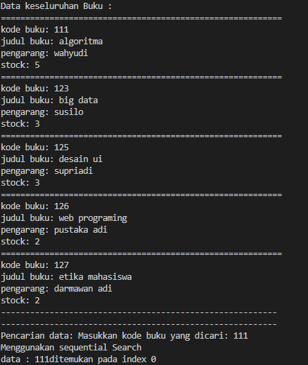
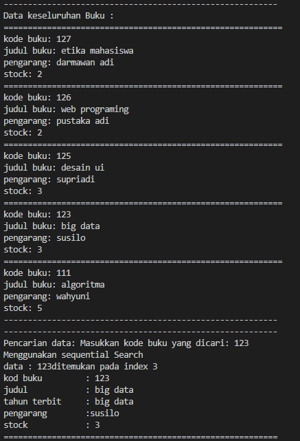
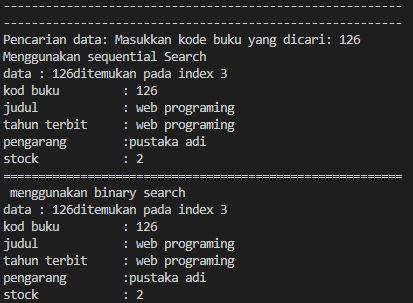
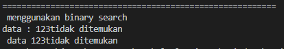
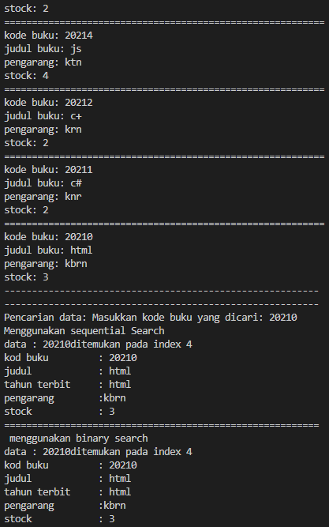
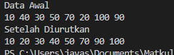

# laporan pertemuan 7 : Searching

NAMA : Kibar Mustofa<br>
KELAS : TI-1H<br>
NIM : 2341720004<br>
ABSEN : 14<br>

Tujuan Praktikum
Setelah melakukan materi praktikum ini, mahasiswa mampu:
1. Menjelaskan mengenai algoritma Searching.
2. Membuat dan mendeklarasikan struktur algoritma Searching.
3. Menerapkan dan mengimplementasikan algoritma Searching.

## percobaan 1: Searching / Pencarian Menggunakan Agoritma Sequential Search
Perhatikan diagram class Buku di bawah ini! Diagram class ini yang selanjutnya akan dibuat 
sebagai acuan dalam membuat kode program class Buku.
- class :

Buku

- atribut :

kodeBuku: int

judul: String

tahunTerbit: int

pengarang: String

stock : int
- method:

Buku(kodeBuku:int, judul: String, tahunTerbit: 
int, pengarang: String, stock:int)

tampil(): void

TampilDataBuku():void

Berdasarkan class diagram di atas, akan dibuat class Buku yang berfunsi untuk membuat objek 
buku yang akan dimasukan ke dalam sebuah array. Terdapat sebuah konstruktor berparameter dan 
juga Method tampil() untuk menampilkan semua attribute yang ada.

- class:

PencarianBuku
- atribut:

listBuku: Buku[5]

idx: int
- method:

Tambah(bk: Buku): void

tampil(): void

FindSeqSearch(int cari): int

Tampilpoisisi(int x,int pos): void

TampilData(int x,int pos) :void

Selanjutnya class diagram PencarianBuku merupakan representasi dari sebuah class yang 
berfungsi untuk melakukan operasi-operasi dari objek array Buku, misalkan untuk menambahkan 
objek Buku, menampilkan semua data Buku, untuk melakukan pencarian berdasarkan kode Buku 
menggunakan algoritma Sequential Search, menampilkan posisi dari data yang dicari, serta 
menampilkan data Buku yang dicari.

### kode program:

#### class
```
package pertemuan7;
public class buku14{
    int kodeBuku;
    String judulBuku;
    int tahunTerbit;
    String pengarang;
    int stock;

    public buku14 (int kodeBuku, String judulBuku, int tahunTerbit, String pengarang, int stock){
        this.kodeBuku = kodeBuku;
        this.judulBuku = judulBuku;
        this.tahunTerbit = tahunTerbit;
        this.pengarang = pengarang;
        this.stock = stock;
    }
    
    public void tampilDataBuku(){
    System.out.println("==========================================================");
    System.out.println("kode buku: "+kodeBuku);
    System.out.println("judul buku: "+judulBuku);
    System.out.println("pengarang: "+pengarang);
    System.out.println("stock: "+stock);
    }
}
```
```
package pertemuan7;
public class pencarianbuku14{
    buku14 listBK[]= new buku14[5];
    int idx;

    void tambah(buku14 m){
        if (idx <listBK.length){
            listBK[idx] = m;
            idx++;
        }else{
            System.out.println("data sudah penuh!");
        }
    }
    void tampil(){
        for (buku14 m : listBK){
            m.tampilDataBuku();
        }
    }
    public int findSeqSearch(int cari){
        int posisi= -1;
        for(int j = 0; j < listBK.length; j++ ){
            if (listBK[j].kodeBuku==cari){
                posisi = j;
                break;
            }
        }
        return posisi;
    }
    public void tampilPosisi(int x, int pos){
        if (pos!= -1){
            System.out.println("data : "+x+"ditemukan pada index "+pos);
    
        }else{
            System.out.println("data : "+x+"tidak ditemukan");
        }
    }
    public void tampilData(int x, int pos){
        if (pos!=-1){
            System.out.println("kod buku\t : "+ x );
            System.out.println("judul\t\t : "+ listBK[pos].judulBuku);
            System.out.println("tahun terbit\t : "+listBK[pos].judulBuku);
            System.out.println("pengarang\t :"+listBK[pos].pengarang);
            System.out.println("stock\t\t : "+listBK[pos].stock);

        }else{
            System.out.println(" data "+x+"tidak ditemukan");
        }
    }
}
```
#### kode main
``
import java.util.Scanner;

public class bukumain14 {
    public static void main(String[] args) {
        Scanner s = new Scanner(System.in);
        Scanner s1 = new Scanner(System.in);
         
        pencarianbuku14 data = new pencarianbuku14();
        int jumBuku = 5;

        System.out.println("---------------------------------------------------------");
        System.out.println("Masukkan data buku secara urut dari kodeBuku terkecil : ");
        for(int i = 0; i < jumBuku ; i++) {
            System.out.println("------------------");
            System.out.print("Kode buku \t: ");
            int kodeBuku = s.nextInt();
            System.out.print("Judul buku \t: ");
            String judulBuku = s1.nextLine();
            System.out.print("Tahun terbit \t: ");
            int tahunTerbit = s.nextInt();
            System.out.print("Pengarang \t: ");
            String pengarang = s1.nextLine();
            System.out.print("Stok \t\t: ");
            int stock = s.nextInt();
            
            buku14 m = new buku14(kodeBuku, judulBuku, tahunTerbit, pengarang, stock);
            data.tambah(m);
        }
        System.out.println("---------------------------------------------------------");
        System.out.println("Data keseluruhan Buku : ");
        data.tampil();

        System.out.println("---------------------------------------------------------");
        System.out.println("---------------------------------------------------------");
        System.out.print("Pencarian data: ");
        System.out.print("Masukkan kode buku yang dicari: ");
        int cari = s.nextInt();
        System.out.println("Menggunakan sequential Search");
        int posisi = data.findSeqSearch(cari);
        data.tampilPosisi(cari, posisi);
        data.tampilData(cari, posisi);
        s.close();
        s1.close();
        ```
### tampilan kode apabila di jalankan:
   

### pertanyaan:

1. Jelaskan fungsi break yang ada pada method FindSeqSearch!
-  Fungsi break yang ada pada method FindSeqSearch adalah untuk menghentikan secara paksa proses pencarian saat kondisi yang diinginkan terpenuhi.
2. Jika Data Kode Buku yang dimasukkan tidak terurut dari kecil ke besar. Apakah program masih 
dapat berjalan? Apakah hasil yang dikeluarkan benar? Tunjukkan hasil screenshoot untuk bukti 
dengan kode Buku yang acak. Jelaskan Mengapa hal tersebut bisa terjadi?
- bisa dijalankan karena karena pencarian sekuensial mencari setiap elemen dalam array hingga menemukan elemen yang dicari atau sampai selesai jika tidak ditemukan.
   

3. Buat method baru dengan nama FindBuku menggunakan konsep sequential search dengan tipe 
method dari FindBuku adalah BukuNoAbsen. Sehingga Anda bisa memanggil method 
tersebut pada class BukuMain seperti gambar berikut :

- kode

```
 buku14 dataBuku = data.findbuku(cari);
    if(dataBuku !=  null){
        dataBuku.tampilDataBuku();
    }else{
        System.out.println(" buku tidak di temukan");
    }
```
```
 buku14 dataBuku(int cari){
        for (buku14 buku : listBK ){
            if(buku.kodeBuku == cari){
                return buku;
            }
        }
    }
```
## percobaan 2:Searching / Pencarian Menggunakan Binary Search

### tampilan kode program

#### kode class:
pada class buku14 tidak ada perubahan
pada pencarianbuku14 ada perubahan berupa
```
 public int findBinarySearch(int cari, int left, int right){
        int mid;
        if (right >= left ){
            mid = (right)/2;
            if (cari == listBK[mid].kodeBuku){
                return (mid);
            } else if(listBK[mid].kodeBuku > cari){
                return findBinarySearch(cari, left, mid);
            }else{
                return findBinarySearch(cari, left, right);
            }
        }
        return - 1;
    }
```
#### kode main:
terdapat perubahan pada main yaitu dengan koe sebagai berikut:
```
System.out.println("=========================================================");
        System.out.println(" menggunakan binary search");
        posisi = data.findBinarySearch(cari, 0, jumBuku -1);
        data.tampilPosisi(cari, posisi);
        data.tampilData(cari, posisi);
```

### hasil output program:
  

### pertanyaan:
1. Tunjukkan pada kode program yang mana proses divide dijalankan!
- Proses divide terdapat pada baris mid = (right + left)/2;, di mana array dibagi menjadi dua bagian yang lebih kecil pada setiap iterasi.

2. Tunjukkan pada kode program yang mana proses conquer dijalankan!
-  Proses conquer terdapat pada kondisi if(cari == listBK[mid].kodebuku), di mana nilai tengah (mid) dari array dibandingkan dengan nilai yang dicari (cari). Jika nilai tersebut sama, maka proses conquer dijalankan dengan mengembalikan posisi nilai yang ditemukan.
4. Jika data Kode Buku yang dimasukkan tidak urut. Apakah program masih dapat berjalan? Mengapa 
demikian! Tunjukkan hasil screenshoot untuk bukti dengan kode Buku yang acak. Jelaskan 
Mengapa hal tersebut bisa terjadi? 
- Jika data Kode Buku tidak diurutkan, maka program tidak akan dapat berjalan dengan benar karena dalam pencarian biner, setiap iterasi membagi array menjadi dua bagian dan membandingkan nilai tengah dengan nilai yang dicari. Jika data tidak diurutkan, nilai tengah tidak akan merepresentasikan nilai yang tepat dalam konteks pencarian biner
  

3. Jika Kode Buku yang dimasukkan dari Kode Buku terbesar ke terkecil (missal : 20215, 20214, 
20212, 20211, 20210) dan elemen yang dicari adalah 20210. Bagaimana hasil dari binary search? 
Apakah sesuai? Jika tidak sesuai maka ubahlah kode program binary seach agar hasilnya sesuai!
- hasil tidak seesuai 
kode yang di ubah:
```
public int findBinarySearch(int cari, int left, int right){
        int mid;
        if (right >= left ){
            mid = (right + left)/2;
            if (cari == listBK[mid].kodeBuku){
                return (mid);
            } else if(listBK[mid].kodeBuku > cari){
                return findBinarySearch(cari, mid + 1, right);
            }else{
                return findBinarySearch(cari, left, mid - 1) ;
            }
        }
        return - 1;
    }
```
 

## percobaan 3:Percobaan Pengayaan Divide and Conquer
### tampilan kode
#### kode class:
```
package pertemuan7;

public class mergeSorting14 {
    public void mergeSort(int[] data) {
        sort(data, 0, data.length - 1);
    }

    public void merge(int data[], int left, int middle, int right) {
        int[] temp = new int[data.length];
        for (int i = left; i <= right; i++) {
            temp[i] = data[i];
        }
        int a = left;
        int b = middle + 1;
        int c = left;
        while (a <= middle && b <= right) {
            if (temp[a] <= temp[b]) {
                data[c] = temp[a];
                a++;
            } else {
                data[c] = temp[b]; // Should be temp[b], not temp[a]
                b++;
            }
            c++;
        }
        int s = middle - a;
        for (int i = 0; i <= s; i++) {
            data[c + i] = temp[a + i];
        }
    }

    public void sort(int data[], int left, int right) {
        if (left < right) {
            int middle = (left + right) / 2;
            sort(data, left, middle);
            sort(data, middle + 1, right);
            merge(data, left, middle, right);
        }
    }

    public void printArray(int arr[]) {
        for (int i = 0; i < arr.length; i++) {
            System.out.print(arr[i] + " "); 
        }
        System.out.println(); 
    }
}

```

#### kode main:
```
package pertemuan7;

public class mergeSortMain14 {
    public static void main(String[] args) {
        int data [] = {10,40,30,50,70,20,100,90};
        mergeSorting14 mSort = new mergeSorting14();
        System.out.println("Data Awal");
        mSort.printArray(data);
        mSort.mergeSort(data);
        System.out.println("Setelah Diurutkan ");
        mSort.printArray(data);
    }
}
```
### tampilan output program
 

### latihan 

### kode yang di peroleh 
#### kode class
```
package pertemuan7;
public class buku14{
    int  tahunTerbit, stock;
    String judulBuku, kodeBuku, pengarang;

    buku14 (String kodeBuku, int tahunTerbit, int stock, String judulBuku, String pengarang){
        this.kodeBuku = kodeBuku;
        this.tahunTerbit = tahunTerbit;
        this.stock = stock;
        this.judulBuku = judulBuku;
        this.pengarang = pengarang;
    }

    void tampilDataBuku (){
        System.out.println("===============================");
        System.out.println("Kode Buku : "+kodeBuku);
        System.out.println("Judu Buku : "+judulBuku);
        System.out.println("Tahun Terbit : "+tahunTerbit);
        System.out.println("Pengarang : "+pengarang);
        System.out.println("Stock : "+stock);
    }
}
```
```
package pertemuan7 ;
public class pencarianbuku14 {
    buku14 listBK[] = new buku14[5];
    int idx;

    void tambah(buku14 m) {
        if (idx < listBK.length) {
            listBK[idx] = m;
            idx++;
        } else {
            System.out.println("Data sudah penuh");
        }
    }

    void tampi() {
        for (buku14 m : listBK) {
            m.tampilDataBuku();
        }
    }

    int FindSeqSearch(String cari) {
        int posisi = -1;
        for (int j = 0; j < listBK.length; j++) {
            if (listBK[j].kodeBuku.equalsIgnoreCase(cari)) {
                posisi = j;
                break;
            }
        }
        return posisi;
    }
    
    void Tampilposisi(String x, int pos) {
        if (pos != -1) {
            System.out.println("data : " + x + " ditemukan pada indeks " + pos);
        } else {
            System.out.println("data " + x + " tidak ditemukan");
        }
    }
    
    void TampilData(String x, int pos) {
        if (pos != -1) {
            System.out.println("kode Buku \t: " + x);
            System.out.println("judul \t\t: " + listBK[pos].judulBuku);
            System.out.println("tahun terbit \t: " + listBK[pos].tahunTerbit);
            System.out.println("pengarang \t: " + listBK[pos].pengarang);
            System.out.println("stock \t\t: " + listBK[pos].stock);
        } else {
            System.out.println("data " + x + " tidak ditemukan");
        }
    }
    
    buku14 FindBuku(String cari) {
        for (buku14 buku : listBK) {
            if (buku.kodeBuku.equalsIgnoreCase(cari)) {
                return buku;
            }
        }
        return null;
    }

    int FindBinarySearch(String cari, int left, int right) {
        int mid;
        if (right >= left) {
            mid = (right + left) / 2;
            if (cari.equalsIgnoreCase(listBK[mid].kodeBuku)) {
                return (mid);
            } else if (listBK[mid].kodeBuku.compareToIgnoreCase(cari) > 0) {
                return FindBinarySearch(cari, mid + 1, right);
            } else {
                return FindBinarySearch(cari, left, mid - 1);
            }
        }
        return -1;
    }
    int FindSeqSearchStr (String cari) {
        int posisi = -1;
        for (int j = 0; j < listBK.length; j++) {
            if (listBK[j].judulBuku.equalsIgnoreCase(cari)) {
                posisi = j;
                break;
            }
        }
        return posisi;
    }
    void TampilposisiJudul (String x, int pos) {
            if (pos != -1) {
                System.out.println("data Buku berjudul : " + x + " ditemukan pada indeks " + pos);
            } else {
                System.out.println("data Buku berjudul : " + x + " tidak ditemukan");
            }
    }
    void TampilDataJudul (String x, int pos) {
        if (pos != -1) {
            System.out.println("kode Buku \t: " + listBK[pos].kodeBuku);
            System.out.println("judul \t\t: " + x);
            System.out.println("tahun terbit \t: " + listBK[pos].tahunTerbit);
            System.out.println("Pengarang \t: " + listBK[pos].pengarang);
            System.out.println("Stock \t\t: " + listBK[pos].stock);
        } else {
            System.out.println("data " + x + " tidak ditemukan");
        }
    }
    void mergeSort(int[] data, int left, int right) {
        if (left < right) {
            int middle = (left + right) / 2;
            mergeSort(data, left, middle);
            mergeSort(data, middle + 1, right);
            merge(data, left, middle, right);
        }
    }

    void merge(int[] data, int left, int middle, int right) {
        int n1 = middle - left + 1;
        int n2 = right - middle;

        int[] L = new int[n1];
        int[] R = new int[n2];

        for (int i = 0; i < n1; ++i) {
            L[i] = data[left + i];
        }
        for (int j = 0; j < n2; ++j) {
            R[j] = data[middle + 1 + j];
        }

        int i = 0, j = 0;
        int k = left;
        while (i < n1 && j < n2) {
            if (L[i] <= R[j]) {
                data[k] = L[i];
                i++;
            } else {
                data[k] = R[j];
                j++;
            }
            k++;
        }

        while (i < n1) {
            data[k] = L[i];
            i++;
            k++;
        }

        while (j < n2) {
            data[k] = R[j];
            j++;
            k++;
        }
    }
    int FindBinarySearchJudul(String cari, int left, int right) {
        int[] sortedIndexes = new int[listBK.length];
        for (int i = 0; i < listBK.length; i++) {
            sortedIndexes[i] = i;
        }
        mergeSort(sortedIndexes, 0, listBK.length - 1);

        int mid;
        if (right >= left) {
            mid = (right + left) / 2;
            if (cari.equalsIgnoreCase(listBK[sortedIndexes[mid]].judulBuku)) {
                return sortedIndexes[mid];
            } else if (listBK[sortedIndexes[mid]].judulBuku.compareToIgnoreCase(cari) > 0) {
                return FindBinarySearchJudul(cari, left, mid - 1);
            } else {
                return FindBinarySearchJudul(cari, mid + 1, right);
            }
        }
        return -1;
    }
    void FindAndDisplayDuplicates(String cari) {
        int count = 0;
        int[] duplicateIndexes = new int[listBK.length];
        int duplicateCount = 0;

        for (int i = 0; i < listBK.length; i++) {
            if (listBK[i].judulBuku.equalsIgnoreCase(cari)) {
                count++;
                duplicateIndexes[duplicateCount] = i;
                duplicateCount++;
            }
        }

        if (count > 1) {
            System.out.println("Peringatan: Lebih dari nama judul buku yang telah di temukan sama .");
            System.out.println("Data buku dengan judul yang sama:");
            for (int j = 0; j < duplicateCount; j++) {
                int index = duplicateIndexes[j];
                System.out.println("Kode Buku: " + listBK[index].kodeBuku);
                System.out.println("Judul: " + listBK[index].judulBuku);
                System.out.println("Tahun Terbit: " + listBK[index].tahunTerbit);
                System.out.println("Pengarang: " + listBK[index].pengarang);
                System.out.println("Stock: " + listBK[index].stock);
                System.out.println("--------------------------");
            }
        }
    }
}
```

#### kode main
```
package pertemuan7;

import java.util.Scanner;

public class bukumain14 {
    public static void main(String[] args) {
        Scanner s = new Scanner(System.in);
        Scanner s1 = new Scanner(System.in);

        pencarianbuku14 data = new pencarianbuku14();
        int jumBuku = 5;

        for (int i = 0; i < jumBuku; i++){
        System.out.println("-----------------------------------------------");
        System.out.print("Kode Buku \t : ");
        String kodeBuku = s.next();
        System.out.print("Judul Buku \t : ");
        String judulBuku = s1.next();
        System.out.print("Tahun Terbit \t : ");
        int tahunTerbit = s.nextInt();
        System.out.print("Pengarang \t : ");
        String pengarang = s1.nextLine();
        pengarang = s1.nextLine();
        System.out.print("Stock \t : ");
        int stock = s.nextInt();

        buku14 m = new buku14(kodeBuku, tahunTerbit, stock, judulBuku, pengarang);
        data.tambah(m);
        }
        
        System.out.println("-----------------------------------------------");
        System.out.println("Data Keseluruhan Buku : ");
        data.tampi();
        
        System.out.println("-----------------------------------------------");
        System.out.println("-----------------------------------------------");
        System.out.println("Pencarian Data");
        System.out.println("Mencari menggunakan :");
        System.out.println("1. Kode Buku");
        System.out.println("2. Judul Buku");
        System.out.print("Pilih (1/2) : ");
        int plh = s.nextInt();

        switch (plh) {
            case 1:
                System.out.println("Masukkan kode Buku yang dicari");
                System.out.print("Kode Buku : ");
                String cari = s.next();
                System.out.println("Menggunakan Sequential Search");
                int posisi = data.FindSeqSearch(cari);
                data.Tampilposisi(cari, posisi);
                data.TampilData(cari, posisi);
                buku14 dataBuku = data.FindBuku(cari);
                if (dataBuku != null) {
                    dataBuku.tampilDataBuku();
                } else {
                    System.out.println("Buku tidak ditemukan.");
                }
                System.out.println("==============================================");
                System.out.println("Menggunakan Binary Search");
                posisi=data.FindBinarySearch(cari, 0, jumBuku-1);
                data.Tampilposisi(cari, posisi);
                data.TampilData(cari, posisi);
                break;
            case 2:
                System.out.println("Masukkan judul Buku yang dicari");
                System.out.print("Judul Buku : ");
                String cari2 = s1.next();
                System.out.println("Menggunakan Sequential Search");
                int posisi2 = data.FindSeqSearchStr(cari2);
                data.TampilposisiJudul(cari2, posisi2);;
                data.TampilDataJudul(cari2, posisi2);;
                System.out.println("==============================================");
                System.out.println("Menggunakan Binary Search");
                posisi2 = data.FindBinarySearchJudul(cari2, 0, jumBuku-1);
                data.FindAndDisplayDuplicates(cari2);
                data.TampilposisiJudul(cari2, posisi2);
                data.TampilDataJudul(cari2, posisi2);;
                break;
        }
        
        s.close();
        s1.close();
    }
}
```
