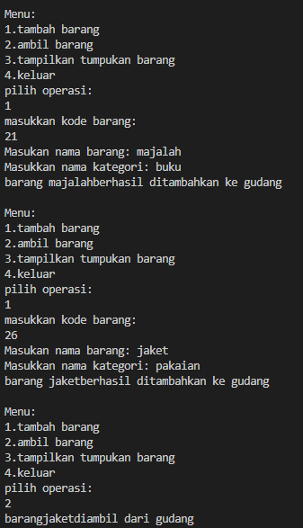
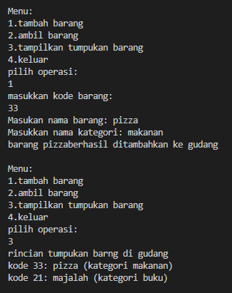
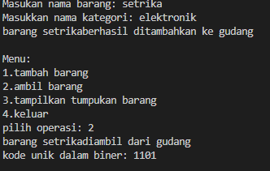
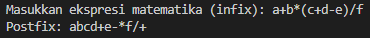
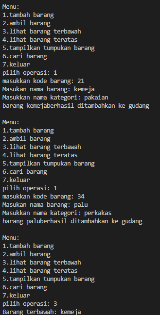
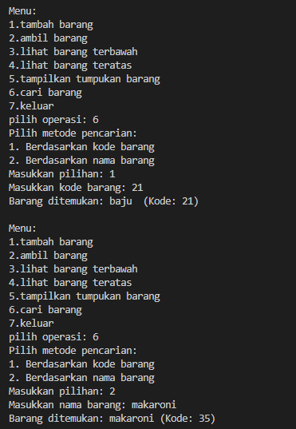

# laporan pertemuan 8 : Stack

NAMA : Kibar Mustofa<br>
KELAS : TI-1H<br>
NIM : 2341720004<br>
ABSEN : 14<br>

### Praktikum 
### 2.1 Percobaan 1: Penyimpanan Tumpukan Barang dalam Gudang

#### class barang:
```
package pertemuan8;

public class barang14 {     
    int kode;              // atribut
    String nama, kategori;

    public barang14(int kode, String nama, String kategori ){                       // method
        this.kode = kode;
        this.nama = nama;
        this.kategori = kategori;
    }
}
```
#### class gudang: 
```package pertemuan8;

public class gudang14 {
    barang14[] tumpukan;
    int size;
    int top;

    public gudang14(int kapasitas){
        size = kapasitas;
        tumpukan = new barang14[size];
        top= - 1;
    }
    public boolean cekKosong(){
        if(top== -1){
            return true;
        }else{
            return false;
        }
    }
    public boolean cekPenuh(){
        if(top== size-1){
            return true;
        }else{
            return false;
        }
    }
    public void tambahBarang(barang14 brg ){
        if(!cekPenuh()){
            top++;
            tumpukan[top]= brg;
            System.out.println("barang "+ brg.nama+"berhasil ditambahkan ke gudang");
        }else{
            System.out.println("gagal! tumpukan barang di gudang sudah penuh");
        }
    }
    public barang14 ambilBarang(){
        if (!cekKosong()){
            barang14 delete = tumpukan[top];
            top--;
            System.out.println("barang " +delete.nama+ "diambil dari gudang");
            System.out.println("kode unik dalam biner: "+ konversiDesimalkeBiner(delete.kode));
            return delete; 
        }else{
            System.out.println("tumpukan baarang kosong");
            return null;
        }
    }
    public barang14 lihatBarangTeratas(){
        if (!cekKosong()){
            barang14 barangTeratas = tumpukan[top];
            System.out.println("Barang teratas: "+ barangTeratas.nama );
            return barangTeratas;
        }else{
            System.out.println("tumpukan barang kosong");
            return null;
        }
    }
    public void tampilkanBarang(){
        if (!cekKosong()){
            System.out.println("rincian tumpukan barng di gudang");
            for (int i = top; i >= 0; i --){
                System.out.printf("kode %d: %s (kategori %s)\n ", tumpukan[i].kode, tumpukan[i].nama, tumpukan[i].kategori);
            }
        }else{
            System.out.println("tumpukan barang kosong.");
        } 
    }
}
```
#### class main:
```
package pertemuan8;
import java.util.Scanner;

public class Utama14 {
    public static void main(String[] args) {
        gudang14 gudang = new gudang14(7);
        Scanner scanner = new Scanner(System.in);
        while (true){
            System.out.println("\nMenu:");
            System.out.println("1.tambah barang");
            System.out.println("2.ambil barang");
            System.out.println("3.tampilkan tumpukan barang");
            System.out.println("4.keluar");
            System.out.print("pilih operasi: ");
            int pilihan = scanner.nextInt();
            scanner.nextLine();

            switch (pilihan) {
                case 1:
                    System.out.print("masukkan kode barang: ");
                    int kode = scanner.nextInt();
                    scanner.nextLine();
                    System.out.print("Masukan nama barang: ");
                    String nama = scanner.nextLine();
                    System.out.print("Masukkan nama kategori: ");
                    String kategori = scanner.nextLine();
                    barang14 barangBaru = new barang14(kode, nama, kategori);
                    gudang.tambahBarang(barangBaru);
                    break;

                case 2:
                    gudang.ambilBarang();
                    break;

                case 3:
                    gudang.tampilkanBarang();
                    break;
                case 4:
                    break;               
                default:
                    System.out.println("Pilihan tidak valid. Silakan coba lagi.");
                    scanner.close();
                }
        }
    }
}
```
### output program :
  
 
#### pertanyaan:
1. Lakukan perbaikan pada kode program, sehingga keluaran yang dihasilkan sama dengan verifikasi 
hasil percobaan! Bagian mana saja yang perlu diperbaiki?
-  ```for (int i = top; i >= 0; i --){ 
    ```
    pada kode berikut yang akan berfungsi menampilkan barang yang di simpan dalam tumpukan

2. Berapa banyak data barang yang dapat ditampung di dalam tumpukan? Tunjukkan potongan kode 
programnya!
- banyak data barang yang bisa ditampung yaitu adalah 7 yang telah di set pada kode class utama
```
 gudang14 gudang = new gudang14(7);
 ```
3. Mengapa perlu pengecekan kondisi !cekKosong() pada method tampilkanBarang? Kalau kondisi 
tersebut dihapus, apa dampaknya?
- pengecekan kondisi !cekKosong() pada method tampilkanBarang() digunakan untuk memastikan bahwa tumpukan (tumpukan) tidak kosong sebelum mencoba menampilkan barang-barang di dalamnya.
4. Modifikasi kode program pada class Utama sehingga pengguna juga dapat memilih operasi lihat 
barang teratas, serta dapat secara bebas menentukan kapasitas gudang!
-
``` 
package pertemuan8;
import java.util.Scanner;

public class Utama14 {
    public static void main(String[] args) {
        gudang14 gudang = new gudang14(7);
        Scanner scanner = new Scanner(System.in);
        while (true){
            System.out.println("\nMenu:");
            System.out.println("1.tambah barang");
            System.out.println("2.ambil barang");
            System.out.println("3.tampilkan tumpukan barang");
            System.out.println("4.lihat barang teratas");
            System.out.println("5.keluar");
            System.out.print("pilih operasi: ");
            int pilihan = scanner.nextInt();
            scanner.nextLine();

            switch (pilihan) {
                case 1:
                    System.out.print("masukkan kode barang: ");
                    int kode = scanner.nextInt();
                    scanner.nextLine();
                    System.out.print("Masukan nama barang: ");
                    String nama = scanner.nextLine();
                    System.out.print("Masukkan nama kategori: ");
                    String kategori = scanner.nextLine();
                    barang14 barangBaru = new barang14(kode, nama, kategori);
                    gudang.tambahBarang(barangBaru);
                    break;

                case 2:
                    gudang.ambilBarang();
                    break;

                case 3:
                    gudang.tampilkanBarang();
                    break;
                case 4:
                    gudang.lihatBarangTeratas();
                    break;     
                case 5:
                    break;          
                default:
                    System.out.println("Pilihan tidak valid. Silakan coba lagi.");
                    scanner.close();
                }
        }
    }
}
```
5. Commit dan push kode program ke Github
### 2.2 Percobaan 2: Konversi Kode Barang ke Biner

#### kode class gudang penambahan method konversi:
```
package pertemuan8;

public class gudang14 {
    barang14[] tumpukan;
    int size;
    int top;

    public gudang14(int kapasitas){
        size = kapasitas;
        tumpukan = new barang14[size];
        top= - 1;
    }
    public boolean cekKosong(){
        if(top== -1){
            return true;
        }else{
            return false;
        }
    }
    public boolean cekPenuh(){
        if(top== size-1){
            return true;
        }else{
            return false;
        }
    }
    public void tambahBarang(barang14 brg ){
        if(!cekPenuh()){
            top++;
            tumpukan[top]= brg;
            System.out.println("barang "+ brg.nama+"berhasil ditambahkan ke gudang");
        }else{
            System.out.println("gagal! tumpukan barang di gudang sudah penuh");
        }
    }
    public barang14 ambilBarang(){
        if (!cekKosong()){
            barang14 delete = tumpukan[top];
            top--;
            System.out.println("barang " +delete.nama+ " diambil dari gudang.");
            System.out.println("kode unik dalam biner: "+ konversiDesimalkeBiner(delete.kode));
            return delete; 
        }else{
            System.out.println("tumpukan barang kosong");
            return null;
        }
    }
    public barang14 lihatBarangTeratas(){
        if (!cekKosong()){
            barang14 barangTeratas = tumpukan[top];
            System.out.println("Barang teratas: "+ barangTeratas.nama );
            return barangTeratas;
        }else{
            System.out.println("tumpukan barang kosong");
            return null;
        }
    }
    public void tampilkanBarang(){
        if (!cekKosong()){
            System.out.println("rincian tumpukan barng di gudang");
            for (int i = top; i >= 0; i --){
                System.out.printf("kode %d: %s (kategori %s)\n ", tumpukan[i].kode, tumpukan[i].nama, tumpukan[i].kategori);
            }
        }else{
            System.out.println("tumpukan barang kosong.");
        } 
    }
    public String konversiDesimalkeBiner(int kode){  //pembaruan
        StackKonversi14 stack = new StackKonversi14();
        while (kode>0){
            int sisa = kode % 2;
            stack.push(sisa);
            kode = kode /2;
        }
        String biner= new String();
        while(!stack.cekKosong()){
            biner+= stack.pop();
        }
        return biner;
    }
}
```
#### penambahan class baru untuk melakuakn konveris stack ke biner:
```
package pertemuan8;

public class StackKonversi14{
    int size;
    int[] tumpukanBiner;
    int top;
    public StackKonversi14(){
        this.size = 32; //asusmi
        tumpukanBiner = new int [size];
        top = -1;
    }
    public boolean cekKosong(){
        return top == -1;
    }
    public boolean cekPenuh(){
        return top == size - 1; 
    }
    public void push(int data){
        if (cekPenuh()){
            System.out.println("Stack penuh");
        }else{
            top++;

            tumpukanBiner[top] = data;
        }
    } 
    public int pop(){
        if (cekPenuh()){
            System.out.println("Stack kosong");
            return -1;
        }else{
            int data = tumpukanBiner[top];
            top--;
            return data;
        }
    } 
}
```
#### penambahan pada  main agar dapat memunculkan konveris pada output:
```
package pertemuan8;
import java.util.Scanner;

public class Utama14 {
    public static void main(String[] args) {
        gudang14 gudang = new gudang14(7);
        Scanner scanner = new Scanner(System.in);
        while (true){
            System.out.println("\nMenu:");
            System.out.println("1.tambah barang");
            System.out.println("2.ambil barang");
            System.out.println("3.tampilkan tumpukan barang");
            System.out.println("4.lihat barang teratas");
            System.out.println("5.keluar");
            System.out.print("pilih operasi: ");
            int pilihan = scanner.nextInt();
            scanner.nextLine();

            switch (pilihan) {
                case 1:
                    System.out.print("masukkan kode barang: ");
                    int kode = scanner.nextInt();
                    scanner.nextLine();
                    System.out.print("Masukan nama barang: ");
                    String nama = scanner.nextLine();
                    System.out.print("Masukkan nama kategori: ");
                    String kategori = scanner.nextLine();
                    barang14 barangBaru = new barang14(kode, nama, kategori);
                    gudang.tambahBarang(barangBaru);
                    break;

                case 2:
                    gudang.ambilBarang();
                    break;

                case 3:
                    gudang.tampilkanBarang();
                    break;
                case 4:
                    gudang.lihatBarangTeratas();
                    break;     
                case 5:
                    break;          
                default:
                    System.out.println("Pilihan tidak valid. Silakan coba lagi.");
                    scanner.close();
                }
        }
    }
}
```
#### output dari program yang dijalankan :
  

#### pertanyaan :
1. Pada method konversiDesimalKeBiner, ubah kondisi perulangan menjadi while (kode != 0), 
bagaimana hasilnya? Jelaskan alasannya!
- jika perulangan pada method konverseDesimalKeBiner dirubah menjadi while (kode != 0) hasilnya akan tetap sama karena  perulangan akan terus terjadi selama kode tidak bernilai 0 atau tidak sama dengan 0
2. Jelaskan alur kerja dari method konversiDesimalKeBiner!
- untuk kode class stackKonversi14 digunakan untuk proses menyimpan sisa bagi bilangan desimal dengan 2 dan selama kode tidak sama dengan 0; kemudian menghitung sisa pembagian dengan 2 dengan metode push akan menempatkan sisa bagi danakan digunakan pada iterasi pada kode selanjutnya
Method pop dari stack untuk mengambil sisa-sisa secara berurutan dari stack. Setiap nilai yang di-pop akan ditambahkan ke string biner, sehingga kita akan mendapatkan representasi biner dari bilangan desimal.Setelah semua sisa telah diambil dan disusun kembali menjadi string biner, kita kembalikan string biner sebagai hasil konversi.

### 2.3 Percobaan 3: Konversi Notasi Infix ke Postfix:

#### class postfix14:
```
package pertemuan8;

public class postfix14{
    int n; 
    int top;
    char[] stack;
    public postfix14(int total) {
        n = total;
        top = -1;
        stack = new char [n];
        push ('(');
    }
    public void push(char c){
        top++;
        stack[top] = c;
    }

    public char pop(){
        char item = stack[top];
        top--;
        return item;
    }
    public boolean isOperand(char c){
        if ((c >= 'A' && c <= 'Z') || (c >= 'a' && c <= 'z') || (c >= '0' && c <= '9') || c == '.') {
            return true;
        } else {
            return false;
        }
    }

    public boolean isOperator(char c){
        if (c == '^' || c == '%' || c == '/' || c == '*' || c == '-' || c == '+') {
            return true;
        } else {
            return false;
        }
    }

    public int derajat(char c){
        switch (c) {
            case '^':
                return 3;
            case '%':
                return 2;
            case '/':
                return 2;
            case '*':
                return 2;
            case '-':
                return 1;
            case '+':
                return 1;
            default:
                return 0;
        }
    }

    public String konversi(String Q){
        String P = "";
        char c;
        for (int i = 0; i < n; i++) {
            c = Q.charAt(i);
            if (isOperand(c)) {
                P = P + c;
            }
            if (c == '(') {
                push(c);
            }
            if (c == ')') {
                while (stack[top] != '(') {
                    P = P + pop();
                }
                pop();
            }
            if (isOperator(c)) {
                while (derajat(stack[top]) >= derajat(c)) {
                    P = P + pop();
                }
                push(c);
            }
        }
        return P;
    }
}
```
#### kode postfix main:
```
package pertemuan8;

import java.util.Scanner;

public class postfixMain14 {
   
    public static void main(String[] args) {
        Scanner sc = new Scanner(System.in);
        String P, Q;

        System.out.print("Masukkan ekspresi matematika (infix): ");
        Q = sc.nextLine();
        Q = Q.trim();
        Q = Q + ")";

        int total = Q.length();

        postfix14 post = new postfix14(total);
        P = post.konversi(Q);
        System.out.println("Postfix: " + P);
        sc.close();
    }
    
}
```
#### hasil output:
  

#### Pertanyaan:

1. Pada method derajat, mengapa return value beberapa case bernilai sama? Apabila return 
value diubah dengan nilai berbeda-beda setiap case-nya, apa yang terjadi?
- Ketika beberapa kasus dalam metode derajat mengembalikan nilai yang sama, itu bisa jadi karena kasus-kasus tersebut memiliki kondisi yang serupa atau identik dalam aliran logika program. Ini berarti bahwa dalam kondisi-kondisi tertentu, output yang diinginkan adalah sama.
2. Jelaskan alur kerja method konversi!
- this.size = 32;: Menginisialisasi variabel size dalam objek StackKonversi14 dengan nilai 32. Ini diasumsikan sebagai ukuran maksimum tumpukan biner.
- tumpukanBiner = new int[size];: Membuat array tumpukanBiner dengan panjang size, yaitu 32. Ini adalah array yang akan digunakan untuk menyimpan elemen-elemen dalam tumpukan biner.
- top = -1;: Menginisialisasi variabel top sebagai -1. Ini menandakan bahwa tumpukan saat ini kosong, karena tidak ada elemen yang dimasukkan.
3. Pada method konversi, apa fungsi dari potongan kode berikut?
``` c = q.charAt(i);
```
- potongan kode c = Q.charAt(i); berfungsi untuk mendapatkan karakter pada posisi i dari string Q. Di sini, Q adalah string yang berisi ekspresi matematika dalam format infix yang dimasukkan oleh pengguna.

### praktikum:
Perhatikan dan gunakan kembali kode program pada Percobaan 1. Tambahkan dua method berikut pada class Gudang:

- Method lihatBarangTerbawah digunakan untuk mengecek barang pada tumpukan terbawah
### kode program:
```
 public barang14 lihatBarangTerbawah(){
        if (!cekKosong()) {
            barang14 barangTerbawah = tumpukan[0];
            System.out.println("Barang terbawah: " + barangTerbawah.nama);
            return barangTerbawah;
        } else {
            System.out.println("Tumpukan barang kosong.");
            return null;
        }
    }
```
### hasil output:
 

- Method cariBarang digunakan untuk mencari ada atau tidaknya barang berdasarkan kode barangnya atau nama barangnya
### kode program:
```
public void cariBarang (Scanner sc) {
        System.out.println("Pilih metode pencarian:");
        System.out.println("1. Berdasarkan kode barang");
        System.out.println("2. Berdasarkan nama barang");
        System.out.print("Masukkan pilihan: ");
        int pilihan = sc.nextInt();
        sc.nextLine();
    
        switch (pilihan) {
            case 1:
                System.out.print("Masukkan kode barang: ");
                int kodeCari = sc.nextInt();
                sc.nextLine();
                boolean ditemukanKode = false;
                for (int i = 0; i <= top; i++) {
                    if (tumpukan[i].kode == kodeCari) {
                        System.out.println("Barang ditemukan: " + tumpukan[i].nama + " (Kode: " + tumpukan[i].kode + ")");
                        ditemukanKode = true;
                        break;
                    }
                }
                if (!ditemukanKode) {
                    System.out.println("Barang dengan kode " + kodeCari + " tidak ditemukan.");
                }
                break;
            case 2:
                System.out.print("Masukkan nama barang: ");
                String namaCari = sc.nextLine();
                boolean ditemukanNama = false;
                for (int i = 0; i <= top; i++) {
                    if (tumpukan[i].nama.equalsIgnoreCase(namaCari)) {
                        System.out.println("Barang ditemukan: " + tumpukan[i].nama + " (Kode: " + tumpukan[i].kode + ")");
                        ditemukanNama = true;
                        break;
                    }
                }
                if (!ditemukanNama) {
                    System.out.println("Barang dengan nama " + namaCari + " tidak ditemukan.");
                }
                break;
            default:
                System.out.println("Pilihan tidak valid.");
                break;
        }
```
 